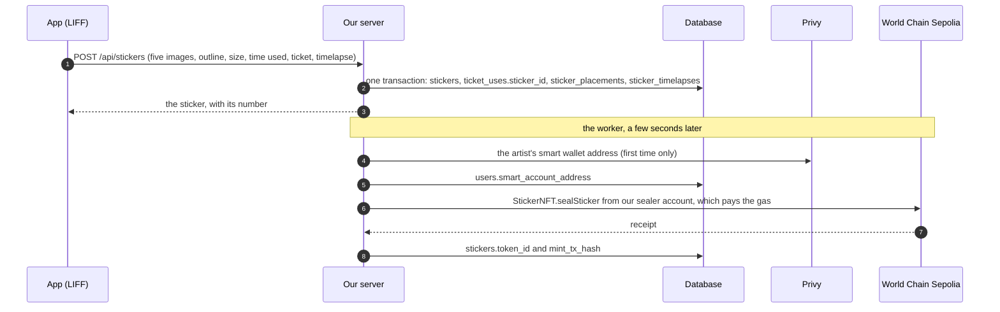
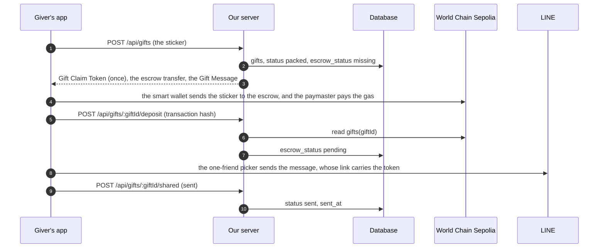
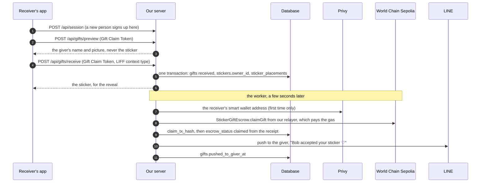
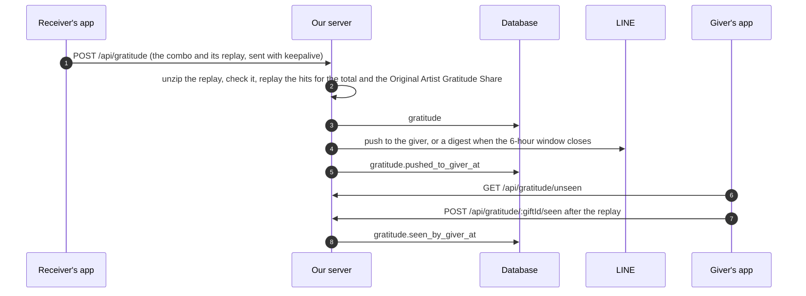
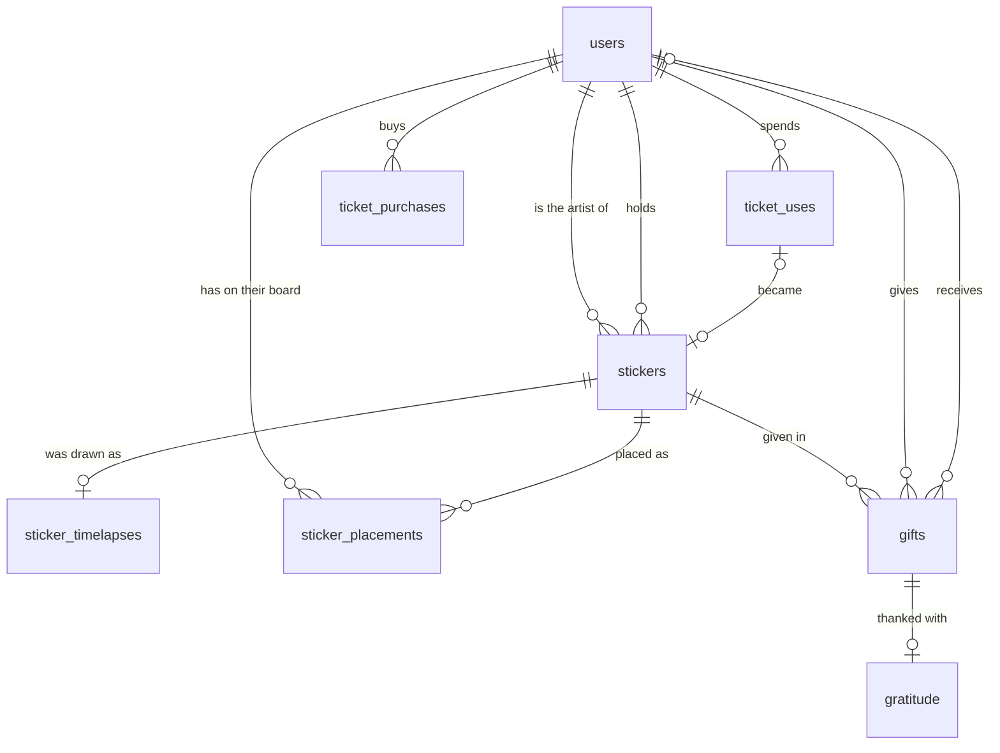

# Database schema: proposal for review

2026-09-25, revised 2026-09-26 after ad0ll's review. For ad0ll's review before it becomes the first Drizzle migration. What's decided is listed under Decided; the rest is under Decisions for you.

**Where to read it:**

- **This doc:** the whole process step by step, then every table with when each column is set, the indexes and the queries they serve, the REST routes, and what's still open.
- **`2026-09-25-database-schema.sql`, next to this doc:** the SQL drizzle-kit generates from the draft, plus the hand-written trigger migration.
- **The draft:** `packages/db/src/schema.ts` on this branch, `worktree-schema-proposal`. It isn't merged. Validation says what ran against it.

**Written against local `main` at 528cf5e** (2026-09-26 09:31). That includes:

- the app's giving flow (`apps/frontend/src/giving/`), tickets (`src/tickets/`), stickers and sealing (`src/stickers/`, `src/sticker-creation/`), the board, stat board and sticker tray (`src/sticker-board/`) and identity (`src/identity/`);
- the gratitude Mini-game design (`docs/superpowers/specs/2026-09-26-gratitude-mini-game-design.md`), whose `GratitudeResult` this schema records, and the stand-in plan it replaces (`docs/superpowers/plans/2026-09-25-gratitude-heart-stand-in.md`, cited as "the gratitude plan").

This branch starts from an older `main`, so those files aren't on it.

**Other sources:**

- `packages/sticker-chain` (the contracts and chain code) and AGENTS.MD's vocabulary, including its Gift Message, Gift Claim Token, Transfer Trail, Hits and Original Artist Gratitude Share;
- the design drafts in `ethglobal-tokyo-2026-design-drafts/drawing-app/`: `PRODUCT.md`, `SCOPE.md`, `DESIGN.md` and `research/build-contract.md` LATEST DECISIONS, cited as "item N";
- LINE's, Privy's and Pimlico's docs, linked where used.

**Precedence:**

- The contracts decide what's on chain.
- AGENTS.MD's vocabulary decides what the words mean.
- Where the app already names a state or a field, the schema uses the app's name.
- ad0ll's answers in this review decide the rest, then the latest design decisions.

## Where each thing lives

| What                                                                                         | On chain (World Chain Sepolia)                                                                | Privy                                   | LINE                                        | Our database                                                                          | Device                                   |
| -------------------------------------------------------------------------------------------- | --------------------------------------------------------------------------------------------- | --------------------------------------- | ------------------------------------------- | ------------------------------------------------------------------------------------- | ---------------------------------------- |
| Who holds a sticker                                                                          | `StickerNFT.ownerOf`: **owner of record**                                                     | the smart wallet that holds it          | —                                           | `stickers.owner_id`, an index of the owner as a person                                | —                                        |
| A sticker's artist, image and metadata                                                       | `artistOf`, `contentHashOf`, `tokenURI`, fixed at mint                                        | —                                       | —                                           | `stickers`, and the five images as files named by the content hash                    | —                                        |
| A gift in transit                                                                            | `StickerGiftEscrow.gifts(giftId)`: sender, recipient, token, claim commitment, expiry, status | —                                       | —                                           | `gifts`, with `escrow_status` as an index of the escrow's status                      | —                                        |
| The Gift Claim Token                                                                         | only its keccak256 commitment                                                                 | —                                       | in the Gift Message's link, in one 1:1 chat | only its keccak256 commitment                                                         | from Packaging until the message is sent |
| Identity                                                                                     | never                                                                                         | a subject derived from the LINE user ID | LINE user ID, name, picture                 | `users`: the LINE user ID, name and picture                                           | —                                        |
| Wallets                                                                                      | addresses appear as owners                                                                    | embedded wallet and smart wallet        | —                                           | `users.smart_account_address`                                                         | —                                        |
| Handle (@alice)                                                                              | ENS, later                                                                                    | —                                       | —                                           | `users.handle`                                                                        | —                                        |
| Tickets                                                                                      | —                                                                                             | —                                       | —                                           | `ticket_uses`, and `ticket_purchases` for paid ones (the Sui payment is a mock today) | —                                        |
| Placement on the Sticker Board, the tray's order, NEW                                        | —                                                                                             | —                                       | —                                           | `sticker_placements`                                                                  | —                                        |
| How a sticker was drawn (the timelapse)                                                      | —                                                                                             | —                                       | —                                           | `sticker_timelapses`                                                                  | until the seal                           |
| Gratitude and its replay                                                                     | a ledger, later                                                                               | —                                       | —                                           | `gratitude`                                                                           | the unsent record, until it lands        |
| Official account pushes                                                                      | —                                                                                             | —                                       | the Messaging API delivers                  | a `pushed_to_giver_at` column on what's announced                                     | —                                        |
| Stats, streaks, leaderboards, glow, the Transfer Trail                                       | —                                                                                             | —                                       | —                                           | derived, never stored                                                                 | —                                        |
| Drawing in progress, brush and smoothing, recent colors, motion permission, sound, intensity | —                                                                                             | —                                       | —                                           | —                                                                                     | yes                                      |

**The rule:**

- World Chain is the owner of record for stickers and gifts.
- The database keeps what the chain never sees, plus three indexed values from the chain that screens list and filter by: `stickers.token_id`, `stickers.owner_id` and `gifts.escrow_status`.
- Screens don't wait for the chain, with three exceptions, each usually a few seconds:
  - giving needs the sticker's mint;
  - sending the Gift Message needs the deposit;
  - giving a sticker on needs the last claim or reject to have landed.

## The whole process, step by step

A sticker's life on chain is at most four kinds of transaction:

- the **mint**, sent by our server;
- the **deposit** into the escrow, sent by the giver's smart wallet;
- the **claim**, sent by our server;
- a **reject**, when a deposited sticker is taken back out.

Everything else happens in our database, in LINE or on the phone.

### 1. Sign in (Login Channel)

1. **Device:** LIFF starts and `LineGate` holds the app until LINE has logged the person in. The app sends `liff.getIDToken()` and the device's time zone to `POST /api/session`.
2. **Server:** verifies the ID token with LINE, then finds the person by `line_user_id`.
   - **New:** inserts `users` with `line_user_id`, `line_display_name`, `line_picture_url` and `time_zone`.
     - The handle is the LINE name, trimmed and NFKC-normalized, if no one has it (ignoring letter case). Otherwise `handle` stays null and the response asks for one.
     - The app shows the handle prompt, and `POST /api/me/handle` sets it. This is the only time the app asks.
   - **Returning:** refreshes `line_display_name` and `line_picture_url`.
   - Either way, it sets the session cookie (no table).
3. **Device → Privy:** `PrivySession` trades the same ID token for a Privy JWT at `POST /v1/auth/privy-jwt`, which already exists. Privy creates the embedded wallet on first login, and the smart wallet once smart wallets are on (see Changes needed).

Nothing happens on chain.

### 2. Draw (Ticket)

1. **Device:** the first stroke starts the clock and calls `POST /api/tickets/spend`.
2. **Server:** in one transaction, reads today's `ticket_uses` for the person (`ticket_day` in their zone, turning over at 4:00).
   - Index 0–2 is free. Index 3 or more needs a verified purchase with tickets left.
   - Inserts `ticket_uses` with the next `day_index`. Two spends can't take the same index, so a double tap can't spend two tickets.

### 3. Seal and mint



- **Files:** the server hashes the sticker PNG (keccak256) and writes the five images as files named by that hash. Identical drawings share the files.
- **Metadata:** it builds the metadata JSON, whose IPFS address is known before anything is uploaded (decision 8).
- **Row:** `number` is the highest so far plus one, in the same transaction.
- **Board:** the sticker lands on the board at once (item 2). `sticker_placements` starts with no placement; the owner's board picks a free spot and saves it (step 6).
- **Mint:** the mint follows (decision 7). The chain package's `sealStickerForArtist` checks the chain first, so a retry after a crash can't mint twice.

### 4. Giving



- **Packaging (`POST /api/gifts`):**
  - The server checks you hold the sticker (`owner_id`) and it's minted (`token_id`), since the deposit moves the NFT.
  - If a gift for this sticker is still packed (the app closed mid-send), it returns that gift instead of making a second one.
  - Otherwise it runs the chain package's `createGiftClaim` and inserts `gifts` (`id`, `sticker_id`, `giver_id`, `claim_commitment`). It returns the Gift Claim Token once and never stores it.
- **Deposit:**
  - The giver's smart wallet sends the transfer that `prepareGiftTransfer` built, with the expiry fixed at 2100-01-01 (decision 5).
  - The server reads the escrow's `gifts(giftId)`: the sender must be the giver's smart wallet, and the token ID, commitment and expiry must be the ones it issued. A match sets `escrow_status` to `pending`.
  - A mismatch sets `status` to `taken_out` and `taken_out_at`, and the worker rejects it.
  - If the app closes before reporting, the worker re-reads every gift still `missing`.
- **Send (`POST /api/gifts/:giftId/shared`):**
  - The picker opens only once the deposit is in.
  - Sent sets `status` to `sent` and `sent_at`.
  - A cancelled or failed picker keeps the gift packed, and the next "Send in LINE" reuses it (decision 6).
- **Take it out (`POST /api/gifts/:giftId/take-out`, only before sending):**
  - Sets `status` to `taken_out` and `taken_out_at`.
  - If the deposit landed, the worker sends `rejectGift` (`reject_tx_hash`), and the receipt sets `escrow_status` to `rejected`. The sticker can't be packaged again until then.

### 5. Receiving



- **Finding the gift:** the server looks it up by the token's hash. If the row still says `missing`, it reads the escrow once, since the deposit may have landed a moment ago.
- **Refusals:**
  - group, multi-person and OpenChat opens (`group`, `room`, `square_chat`);
  - your own gift;
  - a gift already received or taken out;
  - a gift whose deposit isn't in.
- **The receive:** one conditional update decides it. Exactly one person wins, and a forwarded link fails for everyone after. The same transaction:
  - sets `receiver_id`, `received_at` and `status` = `received` (from `packed` too, since a message can go out while the picker never reports back);
  - sets `stickers.owner_id` to the receiver;
  - inserts the receiver's `sticker_placements` row.

  If the sticker has been theirs before, the row is updated instead: same spot on the sticker sheet, back in the tray, NEW again (item 17).

- **The claim:**
  - The claim needs the receiver's smart wallet. The chain package's `authorizeClaim` checks the Gift Claim Token, so it works when the claim is signed during this request.
  - A claim that has to wait (a brand-new receiver whose smart wallet doesn't exist yet) or retry needs the chain package change below, since the server doesn't keep the token.
  - Until the claim lands, the sticker can't be given on.

### 6. The Sticker Board and the sticker tray

- **Landing:** the owner's board lands stickers with no placement on a free spot and saves it with `PATCH /api/sticker-boards/me/sticker-placements/:stickerId`.
- **Moves:** every drag, resize, turn and Remove saves the same way, debounced on release. Remove keeps the spot and sets `on_board` to false.
- **Seen:** when the sticker tray zips shut, `POST /api/sticker-boards/me/sticker-tray/seen` sets `seen_at` on the stickers whose sheet was open. That clears NEW.

### 7. Gratitude (the Mini-game's result)



- **Recording:**
  - The receiver's app keeps the record until it lands and resends it on the next open.
  - The same idempotency key gets the stored record back. A second combo for the same gift is refused (409).
- **Split:** the Original Artist Gratitude Share, 20% of the total out of the giver's part, goes to the Original Artist only when they're neither the giver nor the receiver (item 50). Gratitude to the Original Artist is 100% theirs, and gratitude from them, after a sticker comes back to them, is 100% the giver's.
- **On chain:** gratitude doesn't touch the chain. The on-chain ledger is later (the gratitude plan's §5.5).

### 8. Paid tickets and withdrawal

- **Paid tickets:** `POST /api/ticket-purchases` records the Sui payment's digest. `verified_at` is set once the server has checked it on Sui, and at once while the payment is a mock (decision 14).
- **Withdrawal (`DELETE /api/me`, decision 13):**
  - Clears the LINE columns and the smart wallet address, and sets `withdrawn_at`.
  - Closes gifts still in the bag.
  - Skips pushes to them.

## What's on chain, and what we keep

- **Chain only:**
  - the NFT's artist address, content hash and token URI after the mint;
  - the escrow's sender, recipient, commitment and expiry.

  We read them when verifying and never copy them.

- **Ours, which the chain needs:** `content_hash` and `metadata_uri` exist before the mint, as its input.
- **Indexed from the chain, for screens:**
  - `stickers.token_id`, for building a deposit and mapping chain events to stickers;
  - `stickers.owner_id`, for every board and tray;
  - `gifts.escrow_status`, to gate sending, Receiving and giving on.
- **Local only:**
  - everything LINE and the board produce;
  - gratitude, tickets and the timelapse;
  - the receiver before the claim lands, since the chain only learns them at the claim, and only as an address.

**No indexer for the demo:**

- Our server sends the mint, claim and reject, so it learns each result from its own receipt.
- The one transaction it doesn't send is the deposit, which it reads from the escrow when the app reports it, with a worker re-check.
- An indexer is needed once the chain can change without our server:
  - if the app lets people export their Privy wallet and move stickers themselves;
  - if gifts can expire, since anyone can return an expired one.

  Start then with a log poller in the worker (the NFT's `Transfer`, the escrow's events, the last block read in a one-row table) before Ponder or The Graph.

**The worker's to-do list is read from the rows; there's no job table.**

| Work                        | Rows                                          | Index                      |
| --------------------------- | --------------------------------------------- | -------------------------- |
| Mint                        | `stickers` with no `token_id`                 | `stickers_token_id_unique` |
| Check a deposit             | `gifts` whose `escrow_status` is `missing`    | `gifts_escrow_open`        |
| Claim                       | `received` gifts whose escrow is `pending`    | `gifts_escrow_open`        |
| Reject                      | `taken_out` gifts whose escrow is `pending`   | `gifts_escrow_open`        |
| Push a receive to its giver | `received` gifts with no `pushed_to_giver_at` | `gifts_push_due`           |
| Push gratitude or a digest  | `gratitude` with no `pushed_to_giver_at`      | `gratitude_push_due`       |

- **Pushes:**
  - Each push's `X-Line-Retry-Key` is derived from the gift ID, so every retry sends the same key.
  - LINE answers a repeat with 409, and a key lasts 24 hours, so the worker gives up after 24 hours and sets `pushed_to_giver_at` anyway. https://developers.line.biz/en/docs/messaging-api/retrying-api-request/
  - The month's quota is read from LINE: `GET /v2/bot/message/quota/consumption`.
- **Transactions:** each transaction's hash is stored when sent. A repeat reverts harmlessly, since the contracts check state first.

## The database

- **Engine:** SQLite through Drizzle (better-sqlite3) on the single Hetzner host.
- **Column types:** times are integer milliseconds; hashes and addresses are 0x hex text; uint256 values are decimal text; replays are gzipped JSON in BLOBs.
- **Types:**
  - Everything comes from these tables. API validation derives from them through drizzle-zod, and the app gets its types through Hono's RPC client.
  - drizzle-zod doesn't carry CHECK constraints, so their ranges are repeated as zod refinements.
- **Constraints:** CHECK constraints and partial unique indexes hold every rule a race could slip past.
- **Transactions:**
  - better-sqlite3 transactions are synchronous, so calls to LINE, Privy and the chain happen before or after them, never inside.
  - Transactions that read before writing run as `BEGIN IMMEDIATE`.
- **`created_at` and `updated_at` on every table:**
  - Both default to the database's clock, `cast(unixepoch('subsec') * 1000 as integer)`, so every insert gets them. `created_at` never changes after that.
  - `updated_at` moves on every update in two ways:
    - Drizzle sets it in the statement (`$onUpdate`), so a response's `RETURNING` shows the new time.
    - A trigger per table catches updates made outside Drizzle, such as a hand edit in sqlite3. It acts only when a statement left `updated_at` unchanged.
  - drizzle-kit can't declare triggers, so they live in a custom migration, `drizzle-kit generate --custom --name=updated_at_triggers`: https://orm.drizzle.team/docs/sqlite/kit-custom-migrations
  - drizzle-kit doesn't track triggers. SQLite drops a table's trigger when drizzle-kit rebuilds that table, which it does to change a CHECK, so that migration has to recreate the trigger.

  ```sql
  CREATE TRIGGER `gifts_updated_at` AFTER UPDATE ON `gifts` FOR EACH ROW
  WHEN NEW.`updated_at` IS OLD.`updated_at`
  BEGIN
    UPDATE `gifts` SET `updated_at` = (cast(unixepoch('subsec') * 1000 as integer)) WHERE rowid = NEW.rowid;
  END;
  ```

- **Migrations:**
  - Run by the runtime migrator, not `drizzle-kit push`, which exits 0 when it fails.
  - drizzle-kit rebuilds a table to change one of its constraints, which needs foreign keys off, and SQLite ignores `PRAGMA foreign_keys=OFF` inside the migrator's transaction. So the migrator runs on its own connection opened with foreign keys off, then runs `PRAGMA foreign_key_check` and fails on any row that returns.
  - When this lands, remove `packages/db`'s `db:push` script and delete `data/drawing-app.db`, which holds today's one-table schema.



## The tables, and when each column is set

Every table also has `created_at`, set by the database on insert, and `updated_at`, which moves on every update. They're listed below only where they mean something more.

### users: the person (artist)

Screens:

- every screen, as "me";
- other people's names and pictures on their boards and in the Transfer Trail, the "By" chip, and `ReceiveGiftDialog`;
- handles on the gift tag ("From @alice"), in search and in the Recent row;
- the join date on the stat board's "Since".

| Column                  | Type               | Set when                                                                        | Notes                                                                                                               |
| ----------------------- | ------------------ | ------------------------------------------------------------------------------- | ------------------------------------------------------------------------------------------------------------------- |
| `id`                    | text PK            | First sign-in                                                                   | Server UUID                                                                                                         |
| `line_user_id`          | text, unique       | First sign-in; cleared at withdrawal                                            | The ID token's `sub`. Finds a returning person; the Official account's push target                                  |
| `line_display_name`     | text               | Every sign-in; cleared at withdrawal                                            | LINE gives each person only their own profile, so this is how others see them                                       |
| `line_picture_url`      | text, null         | Every sign-in; cleared at withdrawal                                            |                                                                                                                     |
| `handle`                | text, null         | First sign-in, from the LINE name if no one has it; otherwise the handle prompt | Unique ignoring letter case. Null only until the prompt is answered. Kept after withdrawal, so no one else takes it |
| `time_zone`             | text               | First sign-in, from the device                                                  | Ticket days turn over at 4:00 here (decision 3)                                                                     |
| `smart_account_address` | text, unique, null | The first time the server needs it (the first mint or claim), from Privy        | Lowercase. The mint and claim target, and maps chain addresses to people                                            |
| `terms_accepted_at`     | int, null          | The first action that carries the terms line                                    | Not built in the app yet                                                                                            |
| `withdrawn_at`          | int, null          | Withdrawal                                                                      | A CHECK clears the LINE columns with it                                                                             |
| `created_at`            | int                | First sign-in                                                                   | The stat board's "Since"                                                                                            |

- **Why the LINE columns:**
  - LIFF's `getProfile()` "gets the current user's profile information" only: https://developers.line.biz/en/reference/liff/#get-profile
  - The Messaging API's Get profile answers only for people who've added our Official account and haven't blocked it: https://developers.line.biz/en/reference/messaging-api/#get-profile
- **LINE's User Data Policy** (https://terms2.line.me/LINE_Developers_user_data_policy):
  - keeping these past 24 hours requires telling users (§3.2.3);
  - withdrawal deletes all of it, including the user ID (§3.5.2);
  - the audience must match LINE's own (§3.2.9, decision 9).
- **Why the address:** Privy returns a user's `smart_wallet` address from `POST /v1/users/custom_auth/id`, and a person from an address at `POST /v1/users/smart_wallet/address`. The server needs it from background work with no request in hand, and to map chain addresses to people. So it's stored once, when first needed. https://docs.privy.io/api-reference/users/get-by-custom-auth

### stickers: a sealed sticker (Seal)

Screens:

- the sealed card (number, time used, date, "Sealed on-chain");
- the Sticker Board and the sticker sheets;
- the sticker detail and the ticket stubs' outlines;
- Explore's "Today's stickers" and activity feed.

| Column            | Type               | Set when                             | Notes                                                                                  |
| ----------------- | ------------------ | ------------------------------------ | -------------------------------------------------------------------------------------- |
| `id`              | text PK            | Seal                                 | Server UUID. On chain the sticker key is keccak256 of it                               |
| `number`          | int, unique        | Seal, as the highest so far plus one | Shown as "No.0147". Today the app numbers stickers on the device                       |
| `artist_id`       | → users            | Seal                                 | The Original Artist                                                                    |
| `owner_id`        | → users            | Seal (the artist), then each receive | The owner of record as a person, a few seconds ahead of the chain while a claim lands  |
| `time_used`       | int, 0–180         | Seal                                 | Seconds on the drawing clock, which pauses. The 3-minute timer; see Changes needed     |
| `width`, `height` | int                | Seal                                 | Of the sticker image. The mask and resin masks share them                              |
| `outline`         | text               | Seal                                 | The cut line as an SVG path. Ticket stubs, sheet packing, the given sticker silhouette |
| `content_hash`    | text               | Seal                                 | keccak256 of the sticker PNG. Names its files; passed to the mint                      |
| `metadata_uri`    | text               | Seal                                 | The metadata JSON's IPFS address. Passed to the mint as `tokenURI` (decision 8)        |
| `token_id`        | text, unique, null | When the mint lands                  | Indexed from the chain                                                                 |
| `mint_tx_hash`    | text, null         | When the mint lands, with `token_id` |                                                                                        |
| `created_at`      | int                | Seal                                 | The seal time: the sealed card's date, "Today's stickers", streak days                 |
| `updated_at`      | int                | The mint, and each receive           |                                                                                        |

- **Files, one set per content hash:**
  - `{hash}.png`: the sticker;
  - `{hash}.mask.png`: the cut's shape;
  - `{hash}.spec.png` and `{hash}.rim.png`: the live resin's masks;
  - `{hash}.flat.png`: the sheet as drawn.

  These are the app's `SealedSticker` images. Browsers fetch them directly, so they're files, not blobs.

- **Fixed at seal:** everything but `owner_id` and the mint. There's no delete: `StickerNFT` has no burn, so the app's "Peel off" has no place once stickers are minted.

### sticker_timelapses: how a sticker was drawn

Screens: the timelapse (not built). Its own table, so board and tray reads never load it.

| Column       | Type               | Set when                      | Notes                                          |
| ------------ | ------------------ | ----------------------------- | ---------------------------------------------- |
| `sticker_id` | text PK → stickers | Seal, in the same transaction |                                                |
| `ops`        | blob               | Seal                          | Gzipped JSON; see Replay and timelapse storage |

### ticket_uses: spent tickets (Ticket)

Screens:

- the Draw gate;
- the sealed card's and the out-of-tickets card's ticket stubs, with their stickers' outlines (item 41);
- "New tickets at 4:00 AM".

| Column       | Type                     | Set when                                | Notes                                                              |
| ------------ | ------------------------ | --------------------------------------- | ------------------------------------------------------------------ |
| `id`         | int PK                   | First stroke                            |                                                                    |
| `user_id`    | → users                  | First stroke                            |                                                                    |
| `ticket_day` | text                     | First stroke                            | YYYY-MM-DD in the person's zone, from 4:00                         |
| `day_index`  | int                      | First stroke, as the day's count so far | 0–2 are the free tickets, 3 and up paid. Unique per person and day |
| `sticker_id` | → stickers, unique, null | Seal                                    | Null for good when a drawing is abandoned                          |
| `created_at` | int                      | First stroke                            | When the ticket was spent                                          |
| `updated_at` | int                      | Seal, when the sticker is linked        |                                                                    |

This is the app's own model (`src/tickets/tickets.ts`): uses per ticket day, free first, each linked to the sticker it became.

### ticket_purchases: paid tickets

Screens: the out-of-tickets card's "Get more tickets with Sui", "Pay 0.1 SUI" and "3 tickets added".

| Column        | Type         | Set when                                                                  | Notes                     |
| ------------- | ------------ | ------------------------------------------------------------------------- | ------------------------- |
| `id`          | int PK       | Purchase                                                                  |                           |
| `user_id`     | → users      | Purchase                                                                  |                           |
| `tickets`     | int, > 0     | Purchase                                                                  | 3 per pack today          |
| `price_mist`  | text         | Purchase                                                                  | 0.1 SUI is 100000000 MIST |
| `tx_digest`   | text, unique | Purchase                                                                  | One payment counts once   |
| `verified_at` | int, null    | Once the server has checked the payment on Sui; at once while it's a mock | Decision 14               |

Paid tickets carry over from day to day, as in the app. Paid tickets left = verified purchases' `tickets` minus uses with `day_index` 3 or more.

### sticker_placements: a sticker on a person's Sticker Board (Sticker Board, Sticker tray, Sticker sheet)

Screens:

- your Sticker Board (drag, corner handles, rotate knob, z-order, Remove), the given sticker silhouette, and someone else's board, read-only;
- the sticker tray's sticker sheets, in arrival order, and NEW.

| Column                                         | Type                                                 | Set when                                                                                                                            | Notes                                                                                                                                                       |
| ---------------------------------------------- | ---------------------------------------------------- | ----------------------------------------------------------------------------------------------------------------------------------- | ----------------------------------------------------------------------------------------------------------------------------------------------------------- |
| `user_id`, `sticker_id`                        | PK                                                   | When the sticker first reaches the person: seal for the artist, receive for a gift                                                  | One row per person per sticker they've had                                                                                                                  |
| `on_board`, `x`, `y`, `scale`, `rotation`, `z` | bool, real, real, real, real, int; null until placed | When their board first lands it, then every drag, resize, turn and Remove. A sticker given back goes to the tray (`on_board` false) | The app's placement `{ on, x, y, s, r, z }`: centre as fractions of the field, long side as a fraction of the width, degrees clockwise. All null or all set |
| `seen_at`                                      | int, null                                            | When the tray zips shut with its sticker sheet open. Cleared when the sticker comes back                                            | Null shows NEW                                                                                                                                              |
| `created_at`                                   | int                                                  | Insert                                                                                                                              | The tray's order. Kept when a sticker comes back, so it returns to its old spot                                                                             |

- **Given away:** the row stays. The board keeps the given sticker silhouette where it sat (`GivenStickerSilhouette`), and its spot on the sticker sheet stays empty, so nothing after it shifts, as `traySlots.ts` already does.
- **Receive date:** a received gift's receive date is also `gifts.received_at`. The two differ only when a sticker comes back, since this row keeps its first date.

### gifts: one Giving of one sticker (Giving, Receiving, Packaging)

Screens:

- **Giving:** the give sheet, the gift bag ("In the bag", "Not sent yet"), "Sealed and sent", and PendingGiftsNotificationBadge;
- **Receiving:** `ReceiveGiftDialog` and its refusals;
- **Elsewhere:** the Official account's push, the sticker detail's Transfer Trail and "Given to @bob", the give sheet's Recent row, and the stat board's received and given counts.

| Column                       | Type                                                            | Set when                                                                                                          | Notes                                                                                                             |
| ---------------------------- | --------------------------------------------------------------- | ----------------------------------------------------------------------------------------------------------------- | ----------------------------------------------------------------------------------------------------------------- |
| `id`                         | text PK                                                         | Packaging                                                                                                         | The escrow's `giftId`, from `createGiftClaim`                                                                     |
| `sticker_id`                 | → stickers                                                      | Packaging                                                                                                         | One gift per sticker at a time (see the index)                                                                    |
| `giver_id`                   | → users                                                         | Packaging                                                                                                         |                                                                                                                   |
| `claim_commitment`           | text, unique                                                    | Packaging                                                                                                         | keccak256 of the Gift Claim Token. Receiving finds the gift by it; the escrow can't be searched by it             |
| `status`                     | `packed`, `sent`, `received`, `taken_out`                       | Packaging (`packed`); the picker's report (`sent`); receive (`received`); take-out or a bad deposit (`taken_out`) | The app's `packed` and `sent`, the vocabulary's Receiving, and the app's take-out                                 |
| `escrow_status`              | `missing`, `pending`, `claimed`, `rejected`, `expired_returned` | Packaging (`missing`); the deposit checked (`pending`); the claim or reject lands (`claimed`, `rejected`)         | The contract's GiftStatus, verbatim. `expired_returned` can't happen with the 2100 expiry, and a CHECK refuses it |
| `sent_at`                    | int, null                                                       | LINE's picker reports sent                                                                                        | The app's `sentAt`                                                                                                |
| `taken_out_at`               | int, null                                                       | Take it out, before sending; or a deposit that didn't match                                                       |                                                                                                                   |
| `receiver_id`, `received_at` | → users, int, null                                              | Receive                                                                                                           | Set together                                                                                                      |
| `claim_tx_hash`              | text, null                                                      | The worker sends `claimGift`                                                                                      |                                                                                                                   |
| `reject_tx_hash`             | text, null                                                      | The worker sends `rejectGift`                                                                                     |                                                                                                                   |
| `pushed_to_giver_at`         | int, null                                                       | The Official account's push goes out, or is given up on after 24 hours                                            |                                                                                                                   |
| `created_at`                 | int                                                             | Packaging                                                                                                         | The app's `packedAt`                                                                                              |

| `status`    | Dates set                      | `escrow_status` allowed                                         | Giver sees                                                                                     | Whoever opens the link sees                                                       |
| ----------- | ------------------------------ | --------------------------------------------------------------- | ---------------------------------------------------------------------------------------------- | --------------------------------------------------------------------------------- |
| `packed`    | none                           | `missing` until the deposit lands, then `pending`               | "In the bag"; "Not sent yet" after a cancelled picker                                          | the sleeve and Accept, if the message went out and the picker never reported back |
| `sent`      | `sent_at`                      | `pending`                                                       | "On its way", with no name, since LINE never says who was picked. The sticker leaves the board | "Alice sent you a sticker", and the pull tab                                      |
| `received`  | `received_at`, maybe `sent_at` | `pending` until the claim lands, then `claimed`                 | the given sticker silhouette, and "Bob accepted your sticker ♡" in LINE                        | their board, with the sticker; anyone after: "Already opened"                     |
| `taken_out` | `taken_out_at`                 | `missing`, or `pending` until the reject lands, then `rejected` | the sticker, back                                                                              | — (the message never left)                                                        |

- **CHECKs:** each status has exactly its dates, and only the escrow statuses in the table.
- **Take-back:** there's none once the message is sent (item 5). Nothing is sent or received before the deposit.
- **Tag:** "From @alice", the giver's handle, printed from the gift and never stored (item 15).

### gratitude: one mini-game combo (Gratitude, Mini-game)

Screens:

- the mini-game, its receipt, and the replay;
- the Transfer Trail's rows ("590 came to you, its artist");
- each sticker's glow, and the giver's pink tag;
- the stat board's gratitude receipt and bests, and Explore's weekly leaderboards;
- the Official account's notice.

| Column                            | Type                     | Set when                                                             | Notes                                                                                                                                                   |
| --------------------------------- | ------------------------ | -------------------------------------------------------------------- | ------------------------------------------------------------------------------------------------------------------------------------------------------- |
| `gift_id`                         | text PK → gifts          | Recorded                                                             | One gratitude per received gift, sent by its receiver (item 33). The giver, receiver and sticker come from the gift                                     |
| `idempotency_key`                 | text, unique             | Recorded                                                             | Made on the device at the first hit                                                                                                                     |
| `method`                          | `tap`, `stroke`, `shake` | Recorded                                                             | The method it ended in. Inspired is tap; Magic is stroke or shake                                                                                       |
| `hits`                            | int, 1–120               | Recorded                                                             | Hits: counted taps, stroke passes or shake reversals. One tap that sends is 1. Best combo                                                               |
| `total`                           | int                      | Recorded                                                             | The server's replayed total, multiplier included                                                                                                        |
| `peak_mult`, `peak_tier`          | real 1–8, int 0–4        | Recorded                                                             | Tiers: ありがと, 照れ, ドキドキ, オーバーヒート, 昇天                                                                                                   |
| `original_artist_gratitude_share` | int, 0–total             | Recorded                                                             | The Original Artist Gratitude Share: 20% when the Original Artist is neither the giver nor the receiver, else 0. The giver's part is `total` minus this |
| `game_config_version`             | text                     | Recorded                                                             | `GAME_CONFIG`'s version (`gameConfig.ts`). Every version stays in code for good, for replays                                                            |
| `replay`                          | blob                     | Recorded                                                             | Gzipped JSON; see below                                                                                                                                 |
| `seen_by_giver_at`                | int, null                | The giver finishes watching the replay                               | Drives the pink tag                                                                                                                                     |
| `pushed_to_giver_at`              | int, null                | Its push, or the digest that included it, goes out or is given up on |                                                                                                                                                         |
| `created_at`                      | int                      | Recorded                                                             | Weekly leaderboards; most thanks in a day                                                                                                               |

## Replay and timelapse storage

- **One gzipped JSON blob per replay, never a row per event:**
  - Nothing reads a single hit or point, and a replay always loads whole.
  - Rows per event would be about 120 per combo and several thousand per timelapse.
  - SQLite reads blobs under about 100 KB faster from the database than from separate files: https://www.sqlite.org/intern-v-extern-blob.html
- **Encoding:** the JSON holds integers only, each stored as the change from the one before. The device gzips it with `CompressionStream`, and a version field lets the format change later.
- **Measured on synthetic strokes during validation:**
  - a gratitude replay with 240 taps and a 240-sample stroke is 2.7 KB;
  - a full 3-minute timelapse is 20 KB at 60 Hz and 40 KB at 120 Hz;
  - the same timelapse as the app's raw floats is 175 KB and 352 KB.

**Gratitude replay, version 1:**

```json
{
  "v": 1,
  "seed": 1234567,
  "intensity": 0.7,
  "stage": [390, 844],
  "durationMs": 5420,
  "endReason": "empty",
  "switchedAtHit": 12,
  "hits": [0, 5000, 4800, 1, 180, 20, -35, 1],
  "strokes": [[0, 3000, 6000, 33, 40, -12]],
  "shakes": [0, 1, 140, -1]
}
```

- **`hits`:** every tap, counted or not, as a flat list of ms since the one before, x, y (0–10000 of the stage, each as the change from the one before) and counted (0 or 1).
- **`strokes`:** paths sampled at about 30 Hz, in the same encoding.
- **`shakes`:** reversals, as ms and direction.
- **`switchedAtHit`:** where a tap combo committed to stroke or shake.
- **`seed`:** the random seed for pop-in lines and particles, so the replay looks exactly as it did.
- **`endReason`:** the Mini-game's five: `sent` (one tap), `empty`, `cap`, `hidden`, `closed`.
- **Decoding:** the counted hits' times decode to the result's `hitTimes`, which is what the Mini-game replays.
- **Checking:** the server unzips it and replays the counted hits with `game_config_version` to check `total`, before storing.

**Timelapse, version 1:**

```json
{
  "v": 1,
  "ink": [390, 600],
  "place": [22, 40, 344, 512],
  "ops": [
    ["brush", "#1C1824", 0, [2010, 3020, 80, 0, 27, -3, 0, 16]],
    ["fill", "#E94F64", 41200, 1500, 2600]
  ]
}
```

- **`ink` and `place`:** the ink canvas's size, and where the sticker image sits on it, so the timelapse frames like the sticker.
- **`ops`:** the app's `Op`s in the order drawn.
  - A stroke is its tool, color, start time (`T`, ms into the session) and points. Points are x, y and width in tenths of a pixel, plus ms, each as the change from the point before.
  - A fill is its tool, color, time, x and y.
- **Undo:** version 1 is what's on the sheet at seal, meaning the history's ops, without undone strokes.

## Derived, never stored

- **Streak:**
  - The app's own rule (`userStats.ts`): a ticket day with a sealed sticker adds one; a missed day takes one away, but never below one; today isn't missed until it's over.
  - The server runs it over the person's `stickers.created_at` in their zone (`stickers_artist`). "Longest streak" is the best it has been.
- **Stat board:**
  - Made is the stickers you're the Original Artist of.
  - Received and given are your `received` gifts, to and from you.
  - Gratitude rows:
    - **Inspired:** `total − original_artist_gratitude_share` from tap combos on gifts you gave.
    - **Magic:** the same, from stroke and shake combos.
    - **As the artist:** the Original Artist Gratitude Share on stickers you drew.
  - **Bests:**
    - **Best combo:** the most `hits` in a combo you sent.
    - **Most thanks in a day:** your biggest day of gratitude received.
- **Explore:**
  - weekly leaderboards (from Monday 4:00 Tokyo): most thanked, best combo, longest streak;
  - Today's stickers, by `created_at`;
  - the activity feed of seals and receives;
  - search by handle.
- **Boards:**
  - **Glow:** a sticker's gratitude totals.
  - **Foil:** the Original Artist isn't the board's owner (item 46).
  - **Given sticker silhouette:** your placements of stickers you no longer hold.
  - A sticker with a `sent` gift leaves its giver's board; a `packed` one stays.
- **Sticker tray:**
  - Everything you've had, in `created_at` order.
  - Given stickers leave their spot empty.
  - NEW is `seen_at` null. The app's tray also limits it to stickers that arrived in the current ticket day (`traySlots.ts`).
- **Tickets left:** three minus today's free uses, plus paid tickets left. The next refill is 4:00 in your zone.

## Indexes, and the queries they serve

Every query below was run through `EXPLAIN QUERY PLAN` during validation, and SQLite used the index shown. Primary keys and `UNIQUE` columns are indexes too.

| Query                                         | Where it's used                  | Index                                                                                                   |
| --------------------------------------------- | -------------------------------- | ------------------------------------------------------------------------------------------------------- |
| Find a person by LINE user ID                 | Sign-in                          | `users_line_user_id_unique`                                                                             |
| Is this handle taken? (ignoring case)         | Sign-in, the handle prompt       | `users_handle` on `lower(handle)`                                                                       |
| Handle search (prefix)                        | Explore search                   | `users_handle` (a range on `lower(handle)`)                                                             |
| A person from a chain address                 | Mapping chain events to people   | `users_smart_account_address_unique`                                                                    |
| A Sticker Board, with its stickers            | `StickerBoard`, the sticker tray | `sticker_placements`' primary key, then `stickers`'                                                     |
| Stickers you hold                             | The Give check                   | `stickers_owner`                                                                                        |
| Made, and seal days for the streak            | Stat board                       | `stickers_artist` (covering)                                                                            |
| Today's stickers                              | Explore                          | `stickers_created`                                                                                      |
| A sticker from a chain token ID               | Mapping chain events to stickers | `stickers_token_id_unique`                                                                              |
| Stickers not minted yet                       | The mint worker                  | `stickers_token_id_unique`                                                                              |
| Today's tickets                               | Draw gate, ticket stubs          | `ticket_uses_day`                                                                                       |
| Paid tickets used, bought                     | Tickets left                     | `ticket_uses_day` (covering), `ticket_purchases_user`                                                   |
| Your gifts not yet received                   | PendingGiftsNotificationBadge    | `gifts_giver` on (`giver_id`, `status`)                                                                 |
| Given count                                   | Stat board                       | `gifts_giver` (covering)                                                                                |
| Received count, Best combo                    | Stat board                       | `gifts_receiver`                                                                                        |
| A gift from its Gift Claim Token              | Receiving                        | `gifts_claim_commitment_unique`                                                                         |
| One gift per sticker at a time                | Packaging                        | `gifts_one_per_sticker`: unique, only over gifts `packed` or `sent` or whose escrow still holds the NFT |
| Transfer Trail                                | Sticker detail                   | `gifts_transfer_trail` on (`sticker_id`, `received_at`)                                                 |
| Activity feed                                 | Explore                          | `gifts_received`                                                                                        |
| Deposits to check, claims and rejects to send | The worker                       | `gifts_escrow_open`, only over `missing` and `pending`                                                  |
| Receives to push                              | The worker                       | `gifts_push_due`, only over unpushed receives                                                           |
| Weekly leaderboards, most thanks in a day     | Explore, stat board              | `gratitude_created`, then `gifts`' primary key                                                          |
| Gratitude to push                             | The worker                       | `gratitude_push_due`                                                                                    |
| Unseen gratitude                              | The pink tag                     | `gifts_giver`, then `gratitude`'s primary key                                                           |

The earlier draft's composite keys, job and notice tables, and their indexes are gone. So is an index on unminted stickers, which SQLite never chose over `token_id`'s own.

## REST routes

No routes are implemented; this is their shape.

- **Stack:** Hono with zod validation derived from these tables. The app calls them through Hono's typed client.
- **The Gift Claim Token** travels only in request bodies, never URL paths, so it stays out of server logs.
- **Not routes:** LINE's picker, the escrow deposit (the smart wallet, through Privy), Privy sign-in and the worker.

**Login Channel and the person**

| Route                     | What it does                                                                                                                                                                     | Called from                   | Tables                                     |
| ------------------------- | -------------------------------------------------------------------------------------------------------------------------------------------------------------------------------- | ----------------------------- | ------------------------------------------ |
| `POST /api/session`       | Verifies the LINE ID token with LINE, finds or creates the person, refreshes their LINE name and picture, sets the session cookie. Asks for a handle when the LINE name is taken | `LineGate` once LIFF is ready | `users`                                    |
| `POST /v1/auth/privy-jwt` | Trades the LINE ID token for a Privy JWT. Already exists, on the sticker-auth server                                                                                             | `PrivySession`                | —                                          |
| `GET /api/me`             | Who you are, plus the counts behind the board's NEW and pink-tag badges                                                                                                          | App start, the board's header | `users`, `sticker_placements`, `gratitude` |
| `POST /api/me/handle`     | Sets your handle                                                                                                                                                                 | The handle prompt (not built) | `users`                                    |
| `DELETE /api/me`          | Withdrawal (decision 13)                                                                                                                                                         | Not designed yet              | `users`, `gifts`                           |

**Ticket**

| Route                        | What it does                                                                                    | Called from                                                  | Tables                                        |
| ---------------------------- | ----------------------------------------------------------------------------------------------- | ------------------------------------------------------------ | --------------------------------------------- |
| `GET /api/tickets`           | Today's used tickets with their stickers' outlines, free and paid tickets left, the next refill | `DrawingScreen`, `SealedCard`, `TicketStubs`, `OutOfTickets` | `ticket_uses`, `ticket_purchases`, `stickers` |
| `POST /api/tickets/spend`    | Spends a ticket at the first stroke, or refuses when none are left                              | `DrawingScreen`                                              | `ticket_uses`                                 |
| `POST /api/ticket-purchases` | Records the Sui payment's digest                                                                | `OutOfTickets`                                               | `ticket_purchases`                            |

**Sticker (Seal)**

| Route                                    | What it does                                                                                                      | Called from                                                                           | Tables                                                                |
| ---------------------------------------- | ----------------------------------------------------------------------------------------------------------------- | ------------------------------------------------------------------------------------- | --------------------------------------------------------------------- |
| `POST /api/stickers`                     | Seal: the five images, outline, size, time used, the ticket and the timelapse. Returns the sticker and its number | `DrawingScreen`'s seal step, before `SealCeremony` plays                              | `stickers`, `ticket_uses`, `sticker_placements`, `sticker_timelapses` |
| `GET /api/stickers/:stickerId`           | The sticker detail: the Original Artist, who holds it, the Transfer Trail with each gratitude                     | `StickerDetail`, opened from the board, `StickerToolbar` and `GivenStickerSilhouette` | `stickers`, `users`, `gifts`, `gratitude`                             |
| `GET /api/stickers/:stickerId/timelapse` | The timelapse's ops                                                                                               | The timelapse (not built)                                                             | `sticker_timelapses`                                                  |

Images are static files named by content hash, not routes. `StickerFigure`, `PlacedSticker` and `LiveResin` read them.

**Sticker Board, sticker tray and stat board**

| Route                                                        | What it does                                                                                          | Called from                                                               | Tables                                    |
| ------------------------------------------------------------ | ----------------------------------------------------------------------------------------------------- | ------------------------------------------------------------------------- | ----------------------------------------- |
| `GET /api/sticker-boards/:userId`                            | A Sticker Board: placements and given sticker silhouettes; on your own, also the tray's order and NEW | `StickerBoard`, `StickerTray`                                             | `sticker_placements`, `stickers`, `gifts` |
| `PATCH /api/sticker-boards/me/sticker-placements/:stickerId` | Saves a sticker placement: `on_board`, `x`, `y`, `scale`, `rotation`, `z`                             | The board's gestures on release, `StickerToolbar`'s Remove, `StickerTray` | `sticker_placements`                      |
| `POST /api/sticker-boards/me/sticker-tray/seen`              | Marks the stickers seen whose sticker sheet was open when the tray zipped shut                        | `StickerTray`                                                             | `sticker_placements`                      |
| `GET /api/sticker-boards/:userId/user-stats`                 | User Stats for the stat board                                                                         | `StatBoard`                                                               | `stickers`, `gifts`, `gratitude`          |

**Giving**

| Route                              | What it does                                                                                                                                                                   | Called from                                                      | Tables  |
| ---------------------------------- | ------------------------------------------------------------------------------------------------------------------------------------------------------------------------------ | ---------------------------------------------------------------- | ------- |
| `POST /api/gifts`                  | Packaging: checks you hold the sticker and it's minted, returns the open gift or stores a new one. Returns the Gift Claim Token once, the escrow transfer and the Gift Message | `Giving` ("Send in a LINE chat"), in place of `giftBackend.pack` | `gifts` |
| `POST /api/gifts/:giftId/deposit`  | The transfer your smart wallet sent; the server checks the escrow                                                                                                              | `Giving`                                                         | `gifts` |
| `POST /api/gifts/:giftId/shared`   | The picker's result: sent, or cancelled                                                                                                                                        | `Giving`, in place of `markSent` and `markNotSent`               | `gifts` |
| `POST /api/gifts/:giftId/take-out` | Take it out, before sending                                                                                                                                                    | `GiftBag`, `Giving`                                              | `gifts` |
| `GET /api/gifts/pending`           | Your gifts not yet received                                                                                                                                                    | PendingGiftsNotificationBadge (not built), `StickerBoard`        | `gifts` |

**Receiving**

| Route                     | What it does                                                                                                            | Called from                                | Tables                                    |
| ------------------------- | ----------------------------------------------------------------------------------------------------------------------- | ------------------------------------------ | ----------------------------------------- |
| `POST /api/gifts/preview` | Body: the Gift Claim Token. The giver's name and picture and whether it can be received, never the sticker              | `ReceiveGiftDialog` (not built)            | `gifts`, `users`                          |
| `POST /api/gifts/receive` | Body: the Gift Claim Token and LIFF's context type. Receives it and returns the sticker for the reveal, or says why not | `ReceiveGiftDialog`'s pull tab (not built) | `gifts`, `stickers`, `sticker_placements` |

**Gratitude**

| Route                              | What it does                                                                                  | Called from                                                | Tables               |
| ---------------------------------- | --------------------------------------------------------------------------------------------- | ---------------------------------------------------------- | -------------------- |
| `POST /api/gratitude`              | One combo and its replay, sent with `keepalive`. The same key again returns the stored record | The mini-game (not built), and its resend on the next open | `gratitude`          |
| `GET /api/gratitude/unseen`        | Gratitude to you that you haven't watched                                                     | The board's pink tag (not built)                           | `gifts`, `gratitude` |
| `GET /api/gratitude/:giftId`       | One combo with its replay                                                                     | The pink tag, the Transfer Trail (not built)               | `gratitude`          |
| `POST /api/gratitude/:giftId/seen` | Marks it watched                                                                              | The replay (not built)                                     | `gratitude`          |

**Explore**

| Route                    | What it does                                                 | Called from                           | Tables                                    |
| ------------------------ | ------------------------------------------------------------ | ------------------------------------- | ----------------------------------------- |
| `GET /api/explore`       | Today's stickers, the activity feed, the weekly leaderboards | `ExploreScreen` (a placeholder today) | `stickers`, `gifts`, `gratitude`, `users` |
| `GET /api/users?handle=` | Search by handle                                             | Explore search (not built)            | `users`                                   |

## Decided (ad0ll, 2026-09-26)

- **LINE:** store the LINE user ID. The LINE name and picture are cached on `users`, with no separate table.
- **Privy:** store the smart wallet address on `users`, with no `wallets` table.
- **Timestamps:** `created_at` and `updated_at` on every table, with an `updated_at` trigger per table.
- **The sticker tray:** every sticker you've had, in the order it reached you. Given stickers leave their spot empty. NEW marks unseen ones, with `seen_at` stored on the server.
- **Handles:** each person's is their LINE name. The app asks for one only at sign-up, when someone already has that name.
- **Gifts:** a `status` column (`packed`, `sent`, `received`, `taken_out`) beside each step's date. Only LINE chats: no giving by handle in the demo.
- **Numbers and names:**
  - `number`, not `no`;
  - `hits`, not events;
  - "sticker placement" in the route and table names.
- **Storage:** replays as one gzipped JSON blob each, and a timelapse for every sticker.
- **Chain:** no indexer for the demo.
- **Timer:** the drawing timer is 3 minutes.
- **The Original Artist Gratitude Share** goes to the Original Artist only when they're neither the giver nor the receiver. Gratitude to the Original Artist is 100% theirs; gratitude from them, after a sticker comes back to them, is 100% the giver's.
- **Original Artist** joins the vocabulary: the person who created a given sticker, named in full where "artist" alone would be ambiguous.

## Decisions for you (defaults in bold)

1. **Where gratitude comes from.**
   - **Only the mini-game, as the vocabulary says:** the stat board's Daily row goes. This goes against the stat board's design.
   - Or Daily gratitude for sealing too, which needs a formula and a vocabulary change.
2. **When a ticket is spent.**
   - **At the first stroke,** as the vocabulary and the app have it.
   - Or at seal.
3. **Whose clock turns the day.**
   - **Tickets, streaks, "best day" and NEW use the person's zone,** taken from the device at sign-up and never changed. Explore's "Today's stickers" and the weekly leaderboards use Tokyo.
   - Or Tokyo for everything.
4. **Number vs token ID.**
   - **Separate:** the number is assigned at seal, and the token ID by the contract at mint.
   - Or change `StickerNFT` to mint with token ID = number.
5. **Gift expiry.**
   - **2100-01-01, effectively never,** since item 10 says an unopened gift stays "on its way".
   - Or N days, with returned gifts becoming something people see. That needs a `returned` status and the indexer above.
6. **The deposit, and a cancelled picker.**
   - **The deposit happens at Packaging, as the vocabulary has it. A cancelled or failed picker keeps the gift packed, and "Send in LINE" reuses it.** One deposit per gift, and a take-out costs one reject.
   - Or one gift per picker attempt, as the app does now, with a reject for each cancel.
7. **"Sealed on-chain".**
   - **The sticker is usable at once, and the mint follows;** giving waits for the mint.
   - Or wait for the mint, as the chain package's README suggests.
8. **Images and metadata.** `tokenURI` is permanent, so the metadata has to outlive hostnames.
   - **The metadata JSON and the PNG pinned on IPFS before the mint,** which needs a pinning service key (none is set up).
   - Or metadata at an immutable URL on a domain we'll keep.
   - Either way, the metadata holds only what can stay public forever: the number, the image, its content hash, width and height, and the seal date. Never LINE data or the handle.
9. **Who sees LINE names and pictures** (LINE's policy, §3.2.9).
   - **Signed-in LINE users; public pages show handles and stickers.**
   - Or everyone.
10. **Leaderboards.**
    - **Everyone.** An opt-out would add one column to `users`.
    - Or opt-in only.
11. **Streak decay.**
    - **The app's rule: each missed day lowers it by one, never below one once started.**
    - Or one drop per gap.
12. **Sticker names.**
    - **The number only, for now, with a number-based ENS label later.** This puts off item 4.
    - Or an app-picked or artist-typed name.
13. **Withdrawal.** LINE's policy requires deleting their LINE data.
    - **LINE data and the smart wallet address go at once, and pushes to them stop.**
    - **Their stickers keep them as the Original Artist, and past Transfer Trails keep their entries, shown without a name.**
    - **Gifts still in their bag are taken out, with a reject if deposited. Messages they already sent keep working, since a claim needs only our authorization and the receiver's smart wallet.**
    - **Their handle stays reserved.**
    - **Keep the Privy user. Signing in again with the same LINE account starts a new person, and the stickers still in that smart wallet come back to them.** Or delete the Privy user, which leaves those stickers out of reach for good.
14. **Paid tickets while the Sui payment is a mock.**
    - **Record mock purchases as verified, at most one pack a day, until the payment is real. Then the server checks each digest on Sui.**
    - Or no paid tickets until the payment is real.

## Changes needed elsewhere

These are proposals; this branch changes only `packages/db` and this doc.

**Privy, Pimlico and chain setup** (dashboards; the Privy secret has no API for app settings):

- **Privy dashboard, smart wallets:**
  - Turn smart wallets on, with type "Alchemy" (LightAccount). https://dashboard.privy.io/apps?page=smart-wallets
  - Add World Chain Sepolia as a custom chain if it isn't listed:
    - chain ID 4801;
    - RPC `https://worldchain-sepolia.g.alchemy.com/public`;
    - bundler and paymaster `https://api.pimlico.io/v2/4801/rpc?apikey=…`.
  - Existing users keep their first smart wallet type if it changes later. https://docs.privy.io/wallets/using-wallets/evm-smart-wallets/setup/configuring-dashboard
  - Check that a deployed LightAccount accepts `safeTransferFrom`, since the mint and the claim use it.
- **Privy dashboard, JWT auth:** the setup guide's step is "Request access to Custom authentication in the Integrations > Built-in tab". The app's public config still says `custom_jwt_auth: false`. https://docs.privy.io/authentication/user-authentication/jwt-based-auth/setup
- **Pimlico:** an account and API key. Pimlico supports 4801 for Safe, LightAccount, Simple and Thirdweb accounts, not Kernel or Biconomy. https://docs.pimlico.io/guides/supported-chains
- **Privy's own gas sponsorship** covers World Chain mainnet, not Sepolia. https://docs.privy.io/wallets/gas-and-asset-management/gas/overview
- **Our server's accounts:**
  - World Chain Sepolia ETH from the faucet (https://www.alchemy.com/faucets/world-chain-sepolia), since they send the mint, claim and reject.
  - `SEALER_ROLE` on `StickerNFT` and `CLAIM_SIGNER_ROLE` on the escrow.
- **Sui gas sponsorship:**
  - Privy only signs Sui transactions: https://docs.privy.io/wallets/overview/chains
  - Sponsoring needs Enoki or Shinami and a secret key on our server: https://docs.sui.io/develop/transaction-payment/sponsor-txn
  - The payment can't come out of the gas coin, as `payments/sui.ts`'s comment plans.
  - Nothing to do while the payment is a mock.

**packages/sticker-chain** (for its owner):

1. **Authorize claims and rejections by gift ID.**
   - `authorizeClaim` and `authorizeRejection` require the Gift Claim Token. The server doesn't keep it, so a claim that waits for a new receiver's smart wallet, or any retry, can't be signed.
   - **Proposal:**
     - both helpers take the gift ID;
     - `findGift` also returns the receiver, so a claim can only go to them;
     - the token check moves to our receive endpoint.
2. **A deposit check** beside `prepareGiftTransfer`: the escrow's `gifts(giftId)` against our gift.
3. **Adapters, no change needed:**
   - `findGift` returns the 2100 expiry constant, and `null` for `missing`;
   - `findSticker` passes `created_at` as `sealedAt`.

**The app** (`apps/frontend`):

- **Timer:** done on branch `design/three-minute-timer` (533a4f2, from local `main`, not merged): `SESSION_MS` is 3 minutes, and the clock's tests and comments say 3:00. PRODUCT.md in the design drafts (2026-09-22, "Every drawing is a 5-minute session") still says 5.
- **Vocabulary:** Original Artist is added on branch `vocab/original-artist` (08c7a8f, not merged). The Original Artist Gratitude Share's definition still says the share applies "when the giver isn't the sticker's artist", without the receiver case above.
- **Sign-in:** `LineGate` calls `POST /api/session` and shows the handle prompt when asked. `useIdentity` takes the handle from the server instead of the LINE name.
- **Drawing screen:** the first stroke calls `POST /api/tickets/spend`.
- **Sealing:**
  - The seal posts the five images, the outline and the timelapse to `POST /api/stickers` instead of IndexedDB.
  - The number comes from the server.
  - The timelapse is the history's ops plus the ink size and `place`, gzipped as above.
- **Board:** reads and saves through the Sticker Board routes, and lands stickers that have no placement.
- **Tray:** the seen marks move from localStorage (`traySeen.ts`) to `seen_at`, and `traySlots.ts` orders by the placement's `created_at` instead of the seal, so received stickers fall in place.
- **Giving:**
  - The gift gets a deposit from the smart wallet (`SmartWalletsProvider`) before the picker opens.
  - A cancel keeps the gift packed (decision 6).
  - Packing again returns the open gift instead of setting one aside as abandoned.
- **Stat board:** "given" counts received gifts; today it counts sent ones, since receiving doesn't exist yet.
- **Not built:**
  - `ReceiveGiftDialog`, where the receiver pulls the tab;
  - the gratitude mini-game;
  - the pink tag and replay;
  - the handle prompt;
  - Explore.

**The gratitude Mini-game design** (`docs/superpowers/specs/2026-09-26-gratitude-mini-game-design.md`):

- `GratitudeResult` gains what the replay needs: each touch's position and whether it counted, stroke paths, shake reversals with their direction, the random seed and the intensity.
- `tuningVersion` becomes `gameConfigVersion`, as the design offers, and part 2 records the gift instead of `stickerId`.
- Its note that the draft needs `sent` among its end reasons is done: the end reason lives in the replay.
- Part 3's server check computes the Original Artist Gratitude Share by the rule above.

## Validation

**What ran,** on 2026-09-26, against this branch's `packages/db/src/schema.ts`:

- **Typing and linting:** tsc and oxlint pass.
- **Migration:** `drizzle-kit generate` makes one migration for all 8 tables. `drizzle-kit generate --custom` made the empty trigger migration, and the triggers were written into it. The runtime migrator applied both to an empty file with foreign keys on.
- **Scripted run:** a throwaway script, deleted afterwards, made 74 checks through the typed client and raw SQL. All passed.
  - **Timestamps:**
    - `created_at` and `updated_at` come from the database clock;
    - an update through Drizzle returns a fresh `updated_at`;
    - a hand edit gets one from its trigger;
    - an update that sets `updated_at` keeps its value;
    - all 8 tables have their trigger.
  - **Flows:**
    - sealing with its ticket, sticker placement and timelapse, then the mint;
    - the board landing a sticker and the tray marking it seen;
    - Packaging, deposit, send and receive;
    - receiving a gift still marked `packed`;
    - giving on after the claim, and giving back, which kept the spot on the sticker sheet and showed NEW again;
    - gratitude from one tap that sends (1 hit), with a gzipped replay that reads back;
    - take-out before and after a deposit;
    - a verified purchase;
    - withdrawal.
  - **20 refusals, as intended:**
    - a handle that differs only in case;
    - a drawing clock past 3:00;
    - a token without its mint transaction;
    - the same ticket slot twice;
    - half a placement;
    - sending or receiving before the deposit, and a status without its date;
    - a second gift for a sticker in the bag, giving on before the claim lands, and packing again before a reject lands;
    - a take-out after sending;
    - a reject on a received gift;
    - an expiry return;
    - a push for a gift nobody received;
    - a combo with no hits, and an Original Artist Gratitude Share above the total;
    - a second gratitude for a gift;
    - the same Sui payment twice;
    - withdrawing with LINE data left.
  - **Reads:**
    - a board;
    - NEW;
    - a Transfer Trail;
    - gratitude received, with the Original Artist Gratitude Share (alice 20, bob 40, carol 0, from a one-tap combo and a combo that paid the share).

    `foreign_key_check` and `integrity_check` were clean.

  - **Query plans:** the 24 queries in the index table, each on the index shown.
- **Review:** there's no reviewer agent in this session, so I reviewed each flow myself against the app on local `main`, the chain package and the designs. What it found is under Changes needed. The unused index was dropped.

**What hasn't run:**

- **External services:** anything outside the database, including LINE, Privy, Pimlico, IPFS and the chain. The chain values were set by hand.
- **Concurrency:** two processes at once. `BEGIN IMMEDIATE` is untested.
- **Sizes:** the replay and timelapse sizes come from synthetic strokes, not a real drawing.
- **Upgrades:** an upgrade from today's `data/drawing-app.db`, which should be deleted instead.

## Vocabulary

- **From AGENTS.MD:** Sticker, Ticket, Seal, Packaging, Giving, Receiving, Gratitude, Mini-game, Sticker Board, Stat board, User Stats, Sticker tray, Sticker sheet, Gift Message, Gift Claim Token, Transfer Trail, Hits, Original Artist (on `vocab/original-artist`), Original Artist Gratitude Share, Login Channel, Official account, Messaging API.
- **Your code names:** GivenStickerSilhouette, UsedStickerSilhouette, PendingGiftsNotificationBadge, ReceiveGiftDialog.
- **The app's names:** the placement's fields, the tray's `here`, `used` and `given`, and the gift states `packed` and `sent`.
- **Code names:** "sticker placement" (`sticker_placements`, `StickerPlacement`), from your note on the route.
- **No new AGENTS.MD entries are proposed.**
