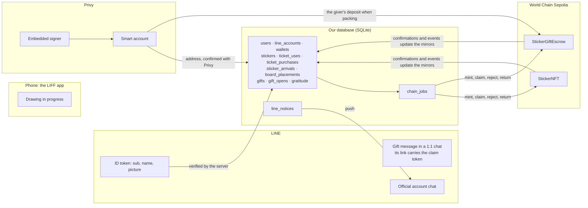
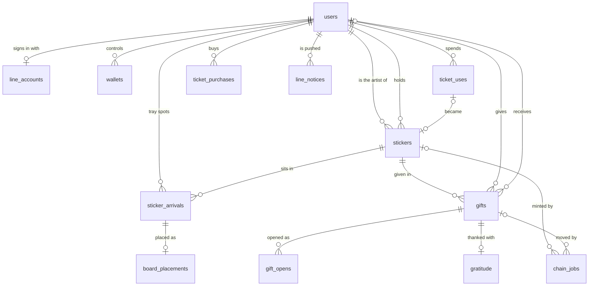

# Database schema: proposal for review

2026-09-25, revised 2026-09-26. For ad0ll's review before it becomes the first Drizzle migration. Nothing here is signed off.

**Where to read it:**

- **This doc:** what each table holds, the screens that read it, and why.
- **`2026-09-25-database-schema.sql`, next to this doc:** the SQL drizzle-kit generates from the draft, for reading the tables as SQL.
- **The draft:** `packages/db/src/schema.ts` on this branch, `worktree-schema-proposal`. It isn't merged. Validation says what has and hasn't been run against it.

**Written against `main` at 505b683** (2026-09-26 00:48). The schema follows the app's giving flow (`apps/frontend/src/giving/`), tickets (`src/tickets/`) and sticker storage (`src/stickers/`), and the gratitude plan's recording contract. This branch starts from an older `main`, so those files aren't on it.

**Sources:**

- drawing-app:
  - the app: `src/giving/` (`giveFlow.ts`, `giftStore.ts`, `giftBackend.ts`, `giftCard.ts`, `giftTag.ts`), `src/tickets/`, `src/stickers/stickerStorage.ts`, `src/identity/useIdentity.ts`, `src/sticker-board/StickerBoard.tsx` and `src/payments/sui.ts`
  - `docs/superpowers/plans/2026-09-25-gratitude-heart-stand-in.md` §5, cited below as "the gratitude plan"
  - `packages/sticker-chain` (the contracts and chain code), today's `packages/db` schema, and AGENTS.MD's vocabulary
- the design drafts in `ethglobal-tokyo-2026-design-drafts/drawing-app/`:
  - `PRODUCT.md`, `SCOPE.md` and `DESIGN.md`
  - `research/build-contract.md` LATEST DECISIONS, cited below as "item N"
  - `signup-give-build.md`, `gratitude-history-brief.md`, `stats-flip-brief.md`, `tray-brief.md`, `sheet-stack-brief.md`, `out-of-tickets-brief.md` and `give-poc.md` §5
  - the prototype's `js/store.js` and screens

**Precedence:**

- The contracts decide what's on chain.
- AGENTS.MD's vocabulary decides what the words mean.
- Where the app already names a state or a field, the schema uses the app's name.
- The latest design decisions decide the rest.

Two defaults below go against a design, and each says so:

- decision 1 drops the stat board's Daily row, because the vocabulary says gratitude only comes from the mini-game;
- decision 12 puts off item 4's ENS sticker names.

## Where each thing lives

| What                                                                                         | On chain (World Chain Sepolia)                                                                | Privy                                                   | LINE                                        | Our database                                                                                        | Device                                 |
| -------------------------------------------------------------------------------------------- | --------------------------------------------------------------------------------------------- | ------------------------------------------------------- | ------------------------------------------- | --------------------------------------------------------------------------------------------------- | -------------------------------------- |
| Who holds a sticker                                                                          | `StickerNFT.ownerOf`: **owner of record**                                                     | the smart account that holds it                         | —                                           | `stickers.owner_id`, which screens read                                                             | —                                      |
| A sticker's artist, image and metadata                                                       | `artistOf`, `contentHashOf`, `tokenURI`, fixed at mint                                        | —                                                       | —                                           | `stickers` (and the PNG as a file named by its hash)                                                | —                                      |
| A gift in transit                                                                            | `StickerGiftEscrow.gifts(giftId)`: sender, recipient, token, claim commitment, expiry, status | —                                                       | —                                           | `gifts`, with `escrow_status` mirroring the escrow                                                  | —                                      |
| The gift link's secret (claim token)                                                         | only its keccak256 commitment                                                                 | —                                                       | in the gift message's link, in one 1:1 chat | only its keccak256 commitment                                                                       | from packing until the message is sent |
| Wallets                                                                                      | addresses appear as owners                                                                    | embedded signer + smart account                         | —                                           | `wallets` (addresses only)                                                                          | —                                      |
| Identity                                                                                     | never                                                                                         | a derived subject, `line_` + a hash of the LINE user ID | LINE user ID, name, picture                 | `line_accounts`, `users`                                                                            | —                                      |
| Handle (@alice)                                                                              | ENS, later                                                                                    | —                                                       | —                                           | `users.handle`                                                                                      | —                                      |
| Tickets                                                                                      | —                                                                                             | —                                                       | —                                           | `ticket_uses`, plus `ticket_purchases` for paid ones. The Sui payment is a mock today (decision 16) | —                                      |
| Board placement, tray spots, NEW marks                                                       | —                                                                                             | —                                                       | —                                           | `board_placements`, `sticker_arrivals`                                                              | —                                      |
| Gratitude and its replay                                                                     | a ledger, later                                                                               | —                                                       | —                                           | `gratitude`                                                                                         | the unsent record, until it lands      |
| Official account pushes                                                                      | —                                                                                             | —                                                       | the Messaging API delivers                  | `line_notices` (outbox)                                                                             | —                                      |
| Stats, streaks, leaderboards, glow, the Transfer Trail                                       | —                                                                                             | —                                                       | —                                           | derived; only the streak is cached                                                                  | —                                      |
| Drawing in progress, brush and smoothing, recent colors, motion permission, sound, intensity | —                                                                                             | —                                                       | —                                           | —                                                                                                   | yes                                    |

Today the app keeps stickers, tickets and gifts on the device. This proposal moves them into the database; decision 17 covers what's already on devices.

**The rule:** our database is what every screen reads. On chain, the NFT is the owner of record. Columns marked _chain mirror_ cache what the contracts hold, and `chain_jobs` tracks the transactions that keep the two in step.

Screens don't wait for the chain, with three exceptions, each usually a few seconds:

- giving needs the sticker's mint;
- sending the gift message needs the deposit;
- giving a sticker on needs the last claim (or reject) to have landed.

## On chain: World Chain Sepolia (4801)

From `packages/sticker-chain`:

- **StickerNFT (ERC-721 "Sticker"):** one token per sealed sticker.
  - Our server's sealer account mints it to the artist's smart account.
  - Per token: the owner; `tokenId`, which the contract counts up from 1 in mint order; `artistOf`, `contentHashOf` and `tokenURI`, all fixed at mint; and `tokenIdForSticker(keccak256(sticker id))`.
  - There's no burn, so a minted sticker can't be deleted.
  - Events: `StickerSealed`, `Transfer`.
- **StickerGiftEscrow:** holds a sticker between Giving and Receiving.
  - **Deposit:** the giver's smart account transfers the sticker in with `(giftId, claimCommitment, expiresAt)`. The contract only checks that these are non-zero, that the expiry is in the future and that the gift ID is new. So our server checks each deposit against the gift it issued (Flows, step 4).
  - **Claim:** anyone relays `claimGift` with our claim signer's EIP-712 `GiftClaim` authorization, which binds the gift, the receiver's smart account and a deadline.
  - **Reject:** a separate `GiftReject` authorization from the same signer returns the sticker to its sender.
  - **Deadlines:** the chain package's helpers make each authorization last at most five minutes, and both claim and reject revert after `expiresAt`.
  - **Expiry:** after `expiresAt`, anyone can return the sticker to its sender.
  - **One gift per token at a time:** depositing a token whose gift is still pending reverts.
  - Status per gift: Missing, Pending, Claimed, Rejected or ExpiredReturned.
  - Events: `GiftStaged`, `GiftClaimed`, `GiftRejected`, `ExpiredGiftReturned`.
- **Accounts and gas:**
  - Everyone gets a Privy embedded signer and a smart account, created through Privy custom auth. It uses our 5-minute JWT, whose subject is `line_` plus a hash of the channel and LINE user ID, so Privy never sees the raw ID.
  - A paymaster sponsors the smart accounts' transactions (the giver's deposit). A server relayer sends the mint, the claim, the reject and expiry returns.
- **Never on chain:** LINE IDs, claim tokens, handles, placements, the tray, tickets, gratitude (for now), stats, and images (only their hash and metadata URI).
- **Not built yet:**
  - ENS handles and sticker names (ENSv2 on Ethereum, asynchronous, never atomic with World Chain)
  - the on-chain gratitude ledger (the gratitude plan's §5.5 has the interface)
  - real Sui payments

## The database

- **Engine and layout:** SQLite through Drizzle (better-sqlite3) on the single Hetzner host.
- **Column types:** times are integer milliseconds; hashes and addresses are 0x hex text; uint256 values are decimal text; JSON is text.
- **Types:**
  - Everything comes from these tables. API validation derives from them through drizzle-zod, and the app gets its types through Hono's RPC client.
  - drizzle-zod carries columns, types and enums, but not CHECK constraints. So ranges (0–300 seconds, 1–120 events, and so on) are repeated as zod refinements. Otherwise the database's refusal reaches the app as a server error.
- **Constraints:** CHECK constraints, partial unique indexes and composite foreign keys hold every rule a race could slip past. That includes the rules that span tables: a ticket's sticker must be its owner's own, and a gratitude's sticker and people must be its gift's.
- **Transactions:**
  - better-sqlite3 transactions are synchronous, so nothing inside one waits on the network. Calls to LINE, Privy and the chain happen before the transaction, or through the outboxes after it.
  - Transactions that read before writing (numbering a sticker, accepting a gift) run as `BEGIN IMMEDIATE`, so a second process can't read the same state first.
- **Migrations:**
  - Generated with `drizzle-kit generate` and run by the runtime migrator, not by `drizzle-kit push`, which exits 0 when it fails.
  - drizzle-kit rebuilds a table to change one of its constraints, which needs foreign keys off. But the migrator wraps each migration in a transaction, and inside one SQLite ignores `PRAGMA foreign_keys=OFF`.
  - So the migrator runs on its own connection, opened with foreign keys off. Then it runs `PRAGMA foreign_key_check` and fails on any row that returns. Only then does the app open its usual connection, with foreign keys on.
  - When this lands, remove `packages/db`'s `db:push` script, and delete `data/drawing-app.db`, which `db:push` made from today's one-table schema. The first migration then starts from an empty file.

### users: the person (artist)

Screens:

- every screen, as "me";
- handles: the gift message's tag ("From @alice"), Explore search, the give sheet's Recent row, and the ENS strip on the stat board;
- the join date: the stat board's "Since";
- streaks: the stat board's calendar leaf and bests.

| Column                                        | Type               | Notes                                                                                                                                                                          |
| --------------------------------------------- | ------------------ | ------------------------------------------------------------------------------------------------------------------------------------------------------------------------------ |
| `id`                                          | text PK            | Server UUID                                                                                                                                                                    |
| `handle`                                      | text, unique, null | ENSIP-15 normalized; Japanese works. Null until the name label is stuck on ("Stick it on"). Until handles exist, the app shows the LINE name in its place. Decision 15         |
| `time_zone`                                   | text               | IANA, taken from the device at sign-up and never changed. Ticket days and streak days turn over at 4:00 here. Decision 3                                                       |
| `terms_accepted_at`, `terms_version`          | int, text          | Accepted on the first action                                                                                                                                                   |
| `privy_user_id`                               | text, unique, null | did:privy:…, once Privy has seen them. Cleared on withdrawal                                                                                                                   |
| `streak_current`, `streak_best`, `streak_day` | int, int, text     | The streak as of `streak_day`, the last ticket day that counted, updated at seal. Readers subtract the decay for days missed since, so nothing has to run at 4:00. Decision 11 |
| `hide_from_leaderboards`                      | bool               | Decision 10                                                                                                                                                                    |
| `created_at`                                  | int                | "Since 2026.08.12"                                                                                                                                                             |
| `withdrawn_at`                                | int, null          | Decision 14                                                                                                                                                                    |

### line_accounts: LINE identity (Login Channel)

Screens:

- the board header (photo sticker and name), the My board tab's picture, and the artist chip;
- the accept screen ("Alice sent you a sticker");
- in-app notices;
- Official account pushes, by LINE user ID.

| Column                        | Type                     | Notes                                                                  |
| ----------------------------- | ------------------------ | ---------------------------------------------------------------------- |
| `user_id`                     | text PK → users, cascade | Its own table, so withdrawal deletes LINE data and nothing else        |
| `line_user_id`                | text, unique             | The verified ID token's `sub`; also the Official account's push target |
| `display_name`, `picture_url` | text                     | Refreshed from the verified token every session, never from the page   |
| `refreshed_at`                | int                      |                                                                        |

LINE's user data policy:

- allows keeping these with notice;
- requires deleting them on withdrawal (decision 14);
- limits who may see them (decision 9).

Email and status message aren't stored. Friends are never stored: LINE gives no friend list, and its policy caps Friend data at 24 hours.

### wallets: Privy addresses

Screens: none; wallets are invisible.

| Column        | Type                            | Notes                                                                                                  |
| ------------- | ------------------------------- | ------------------------------------------------------------------------------------------------------ |
| `id`          | int PK                          |                                                                                                        |
| `user_id`     | → users                         |                                                                                                        |
| `chain_id`    | int                             | 4801                                                                                                   |
| `kind`        | `smart_account` or `signer_eoa` | The chain package's names. Stickers are minted to, and claimed by, the smart account, never the signer |
| `address`     | text                            | Lowercase; unique per chain                                                                            |
| `verified_at` | int                             | When the server confirmed it with Privy                                                                |

One of each kind per person per chain. Withdrawal deletes these rows (decision 14).

### stickers: a sealed sticker (Seal)

Screens:

- the seal card (No., time spent, date, "Sealed on-chain");
- the sticker board and the sticker sheets in the tray;
- the sticker detail's by-line and the ticket stubs' outlines;
- Explore's "Today's stickers" and activity feed.

The gift message shows only a sleeve, never the sticker.

| Column            | Type               | Notes                                                                                                                                                                                                 |
| ----------------- | ------------------ | ----------------------------------------------------------------------------------------------------------------------------------------------------------------------------------------------------- |
| `id`              | text PK            | Server UUID. On chain the sticker key is keccak256 of it                                                                                                                                              |
| `no`              | int, unique        | "No.0147": counted across everyone, assigned in the seal transaction. Decision 4                                                                                                                      |
| `artist_id`       | → users            | Fixed at seal                                                                                                                                                                                         |
| `owner_id`        | → users            | The current holder. While a gift is open it stays the giver, and the sticker sits in escrow on chain                                                                                                  |
| `sealed_at`       | int                | Today's table calls it `created_at`                                                                                                                                                                   |
| `time_used`       | int, 0–300         | Seconds on the drawing clock, which pauses, so it's the app's figure. 0 if sealed within the first second. The app's name                                                                             |
| `width`, `height` | int                | Of the sealed PNG                                                                                                                                                                                     |
| `outline`         | text               | The cut line as an SVG path in image pixels. Used by sheet packing, ticket-stub outlines, foil, and the outline a given sticker leaves on the board. The app's older stickers have none (decision 17) |
| `content_hash`    | text, indexed      | keccak256 of the sealed PNG, which is also its file name. Identical drawings share the file, so the hash isn't unique. **Chain mirror:** `contentHashOf`                                              |
| `metadata_uri`    | text               | Immutable metadata JSON, written and pinned before the mint. Decision 8. **Chain mirror:** `tokenURI`                                                                                                 |
| `token_id`        | text, unique, null | Set when the mint confirms. **Chain mirror**                                                                                                                                                          |
| `minted_at`       | int, null          | Set together with `token_id`                                                                                                                                                                          |

- **Fixed at seal:** everything but `owner_id` and the chain mirror. "Sealed" means unmodifiable.
- **No deleting:** there's no hard delete, and `StickerNFT` has no burn. "Remove" takes a sticker off the board. The app's "Peel off", which deletes a sticker, has no place once stickers are minted.
- **What changes from today's table:** the PNG blob goes to files; the per-sticker `rotation` and the `placement` JSON go to `board_placements`; `created_at` becomes `sealed_at`.
- **`(id, artist_id)`** is also unique, as the target of the keys that tie a ticket's and a gratitude's artist to the sticker's.

### ticket_uses: spent tickets (Ticket)

Screens:

- Draw (the gate);
- the seal card's three stubs;
- the out-of-tickets card: its stubs, with their stickers' outlines (item 41), and "New tickets at 4:00 AM, in 5h 19m".

| Column       | Type                     | Notes                                                                                                                                                               |
| ------------ | ------------------------ | ------------------------------------------------------------------------------------------------------------------------------------------------------------------- |
| `id`         | int PK                   |                                                                                                                                                                     |
| `user_id`    | → users                  |                                                                                                                                                                     |
| `ticket_day` | text                     | YYYY-MM-DD in the person's zone, turning over at 4:00                                                                                                               |
| `seq`        | int                      | Order within the day; unique per person and day                                                                                                                     |
| `source`     | `free` or `paid`         | Free first: `seq` 0–2 are free, and a CHECK allows only three a day. A paid use needs a confirmed purchase with tickets left, which the spending transaction checks |
| `started_at` | int                      | The first stroke. Decision 2                                                                                                                                        |
| `sticker_id` | → stickers, unique, null | Linked at seal. A composite key makes it the ticket owner's own sticker. An abandoned drawing keeps its ticket spent with no sticker                                |

This is what the app keeps on the device today (`src/tickets/tickets.ts`): a ticket day that turns over at 4:00 local time, and the day's uses in order, free ones first, each linked to the sticker it became. The server enforces the limit because every seal costs a mint that our server pays for.

### ticket_purchases: paid tickets

Screens: the out-of-tickets card's "Get more tickets with Sui", its approve step ("Approve 0.1 SUI", "Confirming on Sui…"), and "Paid 0.1 SUI". Decision 16.

| Column                       | Type                             | Notes                                                        |
| ---------------------------- | -------------------------------- | ------------------------------------------------------------ |
| `id`                         | int PK                           |                                                              |
| `user_id`                    | → users                          |                                                              |
| `tickets`                    | int, > 0                         | 3 per pack today                                             |
| `price_mist`                 | text                             | The price in MIST, as decimal text (0.1 SUI is 100000000)    |
| `tx_digest`                  | text, unique                     | The Sui transaction digest, so one payment can't count twice |
| `status`                     | `pending`, `confirmed`, `failed` | Tickets count only once `confirmed`                          |
| `created_at`, `confirmed_at` | int                              | `confirmed_at` is set exactly when confirmed                 |

Paid tickets carry over from day to day, as they do in the app today. So the paid tickets left are the confirmed `tickets` minus every paid use.

### sticker_arrivals: permanent spots in the sticker tray (Sticker tray, Sticker sheet)

Screens:

- the tray's sheets, packed in `seq` order;
- the All, Mine and Gifts tabs (Mine means the artist is me);
- the dates printed on each sheet;
- NEW dots, and the NEW dot on the tray's pull.

| Column                  | Type      | Notes                                                                    |
| ----------------------- | --------- | ------------------------------------------------------------------------ |
| `user_id`, `sticker_id` | PK        | One per sticker a person has ever held                                   |
| `seq`                   | int       | Arrival order, unique per person. A sticker's spot never moves (item 45) |
| `arrived_at`            | int       | At seal for your own, at accept for gifts                                |
| `seen_at`               | int, null | Set when the tray closes with its sheet open; clears NEW                 |

- **Given away:** the sticker keeps its row, so its spot stays blank. Given stickers never show in the tray (item 19).
- **Given back:** the sticker returns to the same spot. It keeps its `seq` and `arrived_at`, and `seen_at` clears so it shows NEW again.
- **Sheets and packing** are derived in the app.

### board_placements: the sticker on the Sticker Board

Screens:

- your sticker board: drag, corner handles, rotate knob, pinch, z-order, and Remove;
- the outline a given sticker leaves on your board;
- someone else's board, read-only.

The vocabulary counts this as part of the Sticker: "the physical presentation of the drawing on the Sticker Board".

| Column                  | Type                  | Notes                                                                                                                          |
| ----------------------- | --------------------- | ------------------------------------------------------------------------------------------------------------------------------ |
| `user_id`, `sticker_id` | PK → sticker_arrivals | The board's owner, one sticker board per person. The key allows a placement only for a sticker that reached that person's tray |
| `on_board`              | bool                  | False once it's removed from the board. The tray shows it either way, since it holds everything you own (item 19)              |
| `x`, `y`                | real, 0–1             | Center, as fractions of the board's field                                                                                      |
| `scale`                 | real                  | The long side as a fraction of board width (the design allows 0.16–0.72)                                                       |
| `rotation`              | real                  | Degrees, set by the rotate knob. It replaces the random tilt each sticker gets today                                           |
| `z`                     | int                   | Stacking; selecting raises it                                                                                                  |
| `updated_at`            | int                   | Saved on release, debounced                                                                                                    |

- **New stickers** you make and receive land on the board automatically (item 2).
- **Given away:** once a sticker's gift message is sent, the sticker leaves its giver's board, as the app does today. While the gift is only packed, it stays.
  - Its placement row stays too. The design keeps a faint outline where it was (item 17), and tapping it opens the read-only detail.
  - The receiver gets a placement of their own.
- **Given back:** the sticker's old placement is updated, not inserted, and the sticker goes to the tray (item 17).

### gifts: one Giving of one sticker (Giving, Receiving; Packaging is the visual of the escrow deposit)

Screens:

- **Giving:** the give sheet, the bag ("In the bag", "Not sent yet"), and "Sealed and sent".
- **Boards:** the pending-gifts indicator at the top right, outgoing and incoming.
- **Receiving:** the accept screen and its guards.
- **Elsewhere:**
  - the in-app notice and the Official account push;
  - the sticker detail's Transfer Trail and "Given to @bob";
  - the give sheet's Recent row;
  - Explore's "gave" rows;
  - the stat board's received and given counts.

| Column             | Type                                                            | Notes                                                                                                                                                                                                                                                                                                  |
| ------------------ | --------------------------------------------------------------- | ------------------------------------------------------------------------------------------------------------------------------------------------------------------------------------------------------------------------------------------------------------------------------------------------------ |
| `id`               | text PK                                                         | Random bytes32: the escrow's `giftId`. The app already makes gift IDs in this format                                                                                                                                                                                                                   |
| `sticker_id`       | → stickers                                                      | One gift per sticker at a time (a partial unique index). That holds while the gift is `packed` or `sent`, and while the escrow still holds the NFT. So a gift given on waits for the last claim, and a re-pack waits for the reject                                                                    |
| `giver_id`         | → users                                                         |                                                                                                                                                                                                                                                                                                        |
| `sent_via`         | `line_chat` or `handle`                                         | Decision 13                                                                                                                                                                                                                                                                                            |
| `recipient_id`     | → users, null                                                   | Known at packing for a handle gift; set by the accept for a LINE chat gift                                                                                                                                                                                                                             |
| `claim_commitment` | text, unique                                                    | keccak256 of the one-time claim token. The token lives only in the gift link (`liff.line.me/{liffId}/g/{token}`, as the app builds it), and the escrow holds this same commitment. A LINE chat gift's accept looks the gift up by it                                                                   |
| `state`            | `packed`, `sent`, `accepted`, `not_sent`, `returned`            | The app's `packed`, `sent` and `not_sent`, plus the two that need a server. See the state table                                                                                                                                                                                                        |
| `not_sent_reason`  | enum, null                                                      | Set exactly when `not_sent`. The app's four: `picker_cancelled`, `send_failed`, `taken_out`, and `abandoned` (still packed when the same sticker was packed again). The server's two: `deposit_failed` (the giver's deposit never landed) and `deposit_mismatch` (it landed but didn't match the gift) |
| `send_error`       | text, null                                                      | Why sending failed, in LINE's words: the app's `error`. Only on `not_sent`                                                                                                                                                                                                                             |
| `escrow_status`    | `missing`, `pending`, `claimed`, `rejected`, `expired_returned` | **Chain mirror**, verbatim. A CHECK allows only the statuses in the state table                                                                                                                                                                                                                        |
| `expires_at`       | int                                                             | The escrow's expiry: 2100-01-01 by default. Decision 5                                                                                                                                                                                                                                                 |
| `idempotency_key`  | text                                                            | Unique per giver                                                                                                                                                                                                                                                                                       |
| `packed_at`        | int                                                             | The app's `packedAt`                                                                                                                                                                                                                                                                                   |
| `sent_at`          | int, null                                                       | The app's `sentAt`: the picker reported the message sent, or the server delivered a handle gift. A `not_sent` gift never has one                                                                                                                                                                       |
| `accepted_at`      | int, null                                                       | Kept if an accepted gift later returns, as the record of the accept                                                                                                                                                                                                                                    |
| `accept_seen_at`   | int, null                                                       | The giver saw "Bob accepted your sticker ♡" in the app                                                                                                                                                                                                                                                 |
| `closed_at`        | int, null                                                       | The app's `closedAt`. Set exactly for `not_sent` and `returned`                                                                                                                                                                                                                                        |

| `state`    | Escrow status allowed                                                                       | Owner in our database | Giver sees                                                                                         | Whoever opens the link sees                                                       |
| ---------- | ------------------------------------------------------------------------------------------- | --------------------- | -------------------------------------------------------------------------------------------------- | --------------------------------------------------------------------------------- |
| `packed`   | `missing` until the deposit, then `pending`                                                 | giver                 | "In the bag"; "Not sent yet" after a cancelled picker (decision 6)                                 | the sleeve and Accept, if the message went out and the picker never reported back |
| `sent`     | `pending`                                                                                   | giver                 | "On its way", with no name ("On its way to @mika" for a handle gift). The sticker leaves the board | the sleeve, "Alice sent you a sticker", Accept                                    |
| `accepted` | `pending` until the claim lands, then `claimed`                                             | receiver              | the outline on the board; "Bob accepted your sticker ♡"                                            | their board with it; anyone after: "Already opened"                               |
| `not_sent` | `missing` if no deposit landed; otherwise `pending` until the reject lands, then `rejected` | giver                 | the sticker, back                                                                                  | — (the message never left)                                                        |
| `returned` | `expired_returned` after expiry; `pending`, then `rejected`, when the server sends it back  | giver                 | the sticker, back (no design copy yet)                                                             | the link no longer works (no design copy yet)                                     |

- **Following the app:** the states, reasons and times are the ones `giftStore.ts` records on the device today, so its `GiftRecord` can come from this table once gifts live on the server.
- **Tag:**
  - "From @alice", the giver's handle, when the message goes through LINE's picker, as `giftTag.ts` prints it. "For @mika" for a handle gift.
  - It's printed from `sent_via`, never typed or stored (item 15).
  - Item 15 and DESIGN.md write "From Alice", the name; the app prints the handle (decision 15).
- **Unknown receiver:**
  - LINE never tells the app who was picked. Until a LINE chat gift is accepted, the giver sees "On its way", with no name.
  - "On its way to @mika" is only possible for a handle gift. The prototype shows a name it couldn't know.
- **Sending:** the message can go out only once the deposit is in. A CHECK refuses `sent` until `escrow_status` is `pending`.
- **Accepting:**
  - One conditional update decides it: the commitment matches, `state` is `packed` or `sent`, the deposit is in, the accepter isn't the giver, and, for a handle gift, the accepter is its recipient.
  - Exactly one accept wins, and a forwarded link fails for everyone after.
  - `packed` is allowed because a message can go out even when the picker never reports back.
- **Group chats:** an open from a group, a multi-person chat or an OpenChat (`group`, `room`, `square_chat`) is refused before that update.
- **Taking it out:** only while packed. It closes the gift as `not_sent` (`taken_out`), as the app does today. Once the message is sent there's no take-back (item 5), and a CHECK refuses `not_sent` for a gift with a `sent_at`.
- **Packing again:** a gift still packed when the same sticker is packed again (the app closed mid-send) closes as `not_sent` (`abandoned`), as the app does today.
- **Returned:** the message went out, or could have, and the sticker went back to its giver: after expiry (decision 5), or because its handle recipient withdrew (decision 14).

### gift_opens: every open of a gift link

Screens: none directly. It's the audit behind the accept screen's guards ("Open this in your chat with Alice", "Already opened").

| Column         | Type                                                                                            | Notes                                                                                             |
| -------------- | ----------------------------------------------------------------------------------------------- | ------------------------------------------------------------------------------------------------- |
| `id`           | int PK                                                                                          |                                                                                                   |
| `gift_id`      | → gifts                                                                                         |                                                                                                   |
| `user_id`      | → users, null                                                                                   | Null when opened before signing in                                                                |
| `context_type` | `utou`, `room`, `group`, `square_chat`, `external`, `none`                                      | From `liff.getContext()`: a hint for refusing group, multi-person and OpenChat opens, never proof |
| `outcome`      | `accepted`, `already_yours`, `own_gift`, `blocked_group`, `already_opened`, `not_ready`, `gone` | `not_ready`: the deposit isn't in yet. `gone`: not sent, or returned                              |
| `created_at`   | int                                                                                             |                                                                                                   |

### gratitude: one mini-game combo (Gratitude, Mini-game)

Screens:

- **The combo itself:** the gratitude mini-game, its receipt, and the replay.
- **The sticker detail:** the Transfer Trail's open row, with "590 came to you, its artist".
- **Boards:** each sticker's glow, and the giver's pink tag on their board.
- **Stats and Explore:** the stat board's gratitude receipt and bests, and Explore's weekly leaderboards.
- **LINE:** the Official account's notice.

The columns follow the gratitude plan's recording contract (§5), with one addition, `switched_at_event`.

| Column                       | Type                               | Notes                                                                                                                                                                                                                                                           |
| ---------------------------- | ---------------------------------- | --------------------------------------------------------------------------------------------------------------------------------------------------------------------------------------------------------------------------------------------------------------- |
| `id`                         | text PK                            |                                                                                                                                                                                                                                                                 |
| `gift_id`                    | → gifts, unique                    | The plan's `handoffId`: one gratitude per accepted gift, sent by its receiver (item 33)                                                                                                                                                                         |
| `sticker_id`                 | → the gift's sticker               | Copied from the gift, for glow and Transfer Trail queries                                                                                                                                                                                                       |
| `from_user_id`               | → the gift's receiver              | The receiver, who played                                                                                                                                                                                                                                        |
| `to_user_id`                 | → the gift's giver                 | The giver                                                                                                                                                                                                                                                       |
| `artist_user_id`             | → the sticker's artist, null       | Set when the artist is neither the giver nor the receiver. The plan gives the artist a share whenever the giver isn't the artist, but when the receiver drew it, they'd pay themselves. A CHECK refuses a share that goes to either side, or that has no artist |
| `method`                     | `tap`, `stroke`, `shake`           | The method the combo ended in. Inspired is tap, and Magic is stroke or shake (SCOPE's reading)                                                                                                                                                                  |
| `switched_at_event`          | int, null                          | Where in `event_times` a combo committed to stroke or shake: 0 if it started there, null for taps only. The replay needs it, since passes and reversals weigh more than taps. The plan's payload doesn't have it yet                                            |
| `events`                     | int, 1–120                         | Counted taps, passes or reversals                                                                                                                                                                                                                               |
| `total`                      | int                                | The server's replayed total, multiplier included                                                                                                                                                                                                                |
| `to_amount`, `artist_amount` | int                                | The artist's share (20%) comes out of the giver's (item 50). It's stored per record, so changing the share never rewrites history. A CHECK makes the two add up to `total`                                                                                      |
| `peak_mult`                  | real, 1–8                          |                                                                                                                                                                                                                                                                 |
| `peak_tier`                  | int, 0–4                           | ありがと, 照れ, ドキドキ, オーバーヒート, 昇天                                                                                                                                                                                                                  |
| `duration_ms`                | int, ≤ 8000                        |                                                                                                                                                                                                                                                                 |
| `end_reason`                 | `empty`, `hidden`, `closed`, `cap` |                                                                                                                                                                                                                                                                 |
| `event_times`                | JSON int[]                         | The replay: ms after the first counted event. A CHECK ties its length to `events`                                                                                                                                                                               |
| `tuning_version`             | text                               | Which tuning the server replayed with                                                                                                                                                                                                                           |
| `idempotency_key`            | text, unique                       | Made on the device at the first counted event. The same key again gets the stored result; another key for the same gift gets a 409 (the plan's §5.3)                                                                                                            |
| `recorded_at`                | int                                | Indexed, for the weekly leaderboards                                                                                                                                                                                                                            |
| `seen_by_giver_at`           | int, null                          | The giver watched the replay. Drives the pink tag and the plan's `GET /api/gratitude/unseen`                                                                                                                                                                    |

- **Composite foreign keys:** they tie `gift_id`, `sticker_id`, `from_user_id` and `to_user_id` to the gift's own sticker, receiver and giver, and `artist_user_id` to the sticker's artist. So a record can't credit the wrong people.
- **Size:** a replay is at most 120 small integers of JSON, so storing and replaying it is trivial for SQLite.

### line_notices: Official account pushes (Messaging API)

Screens: the Official account chat ("Bob accepted your sticker ♡", "Bob sent you gratitude ♡", digests).

| Column                                                                                  | Type                                             | Notes                                                                                                |
| --------------------------------------------------------------------------------------- | ------------------------------------------------ | ---------------------------------------------------------------------------------------------------- |
| `id`                                                                                    | int PK                                           |                                                                                                      |
| `user_id`                                                                               | → users                                          | The recipient                                                                                        |
| `kind`                                                                                  | `gift_accepted`, `gratitude`, `gratitude_digest` |                                                                                                      |
| `dedupe_key`                                                                            | text, unique                                     | e.g. `gift_accepted:{giftId}`: one push per event, however often it retries                          |
| `payload`                                                                               | JSON                                             |                                                                                                      |
| `retry_key`                                                                             | text                                             | Sent as `X-Line-Retry-Key` on every attempt                                                          |
| `status`                                                                                | `queued`, `sent`, `failed`, `cancelled`          | `failed` once retries pass 24 hours, the retry key's lifetime. `cancelled` when the person withdraws |
| `attempts`, `next_attempt_at`, `sent_at`, `line_request_id`, `last_error`, `created_at` |                                                  | `sent_at` counts pushes against the month's quota                                                    |

- **When rows are written:** a push for one event is written in the same transaction as the change it announces.
- **Gratitude, per the plan's §5.4:**
  - The first gratitude to a giver in a 6-hour window pushes at once. Later ones fold into one digest, written when the window closes.
  - Past 80% of the month's quota, the window becomes a day. At 100%, pushes stop, and the app shows the news on its own.
- **Delivery:** a 200 from LINE doesn't prove delivery, so the app shows the same news in-app.
- **The artist's share:** no push is designed for it. The artist sees it in the Transfer Trail and on the stat board.

### chain_jobs: World Chain transactions

Screens: none. Only the "Sealed on-chain" timing depends on it (decision 7).

| Column                                                              | Type                                                           | Notes                                                                                                            |
| ------------------------------------------------------------------- | -------------------------------------------------------------- | ---------------------------------------------------------------------------------------------------------------- |
| `id`                                                                | int PK                                                         |                                                                                                                  |
| `kind`                                                              | `mint`, `confirm_deposit`, `claim`, `reject`, `return_expired` | `reject` covers a gift closed after its deposit landed: `not_sent`, or `returned` by the server                  |
| `dedupe_key`                                                        | text, unique                                                   | e.g. `mint:{stickerId}`, `claim:{giftId}`. The contracts' own checks make a repeat revert harmlessly             |
| `sticker_id`                                                        | → stickers, null                                               | Required for `mint`                                                                                              |
| `gift_id`                                                           | → gifts, null                                                  | Required for the rest                                                                                            |
| `status`                                                            | `queued`, `submitted`, `confirmed`, `failed`, `cancelled`      | `cancelled`, e.g. for a claim on a gift that returned after expiry. `confirmed_at` is set exactly when confirmed |
| `tx_hash`                                                           | text, null                                                     | For `confirm_deposit`, it's the transaction the giver's smart account sent                                       |
| `attempts`, `run_after`, `last_error`, `created_at`, `confirmed_at` |                                                                |                                                                                                                  |

- **Order:** a sticker's or a gift's jobs run in the order they were queued. Each waits while an earlier one for the same sticker or gift hasn't confirmed.
- **Waiting on accounts:** a mint waits for the artist's smart account, and a claim for the receiver's. The chain package requires one on 4801.
- **Signing:** the worker signs a claim or reject when it submits it, since an authorization lasts five minutes.

## Flows: what happens where

1. **Sign in.**
   - The app already waits for LINE Login before it shows anything (`LineGate`).
   - LIFF hands the ID token to our server, which verifies it with LINE, upserts `users` and `line_accounts`, and issues its own session cookie (no table). The token lasts an hour, and LIFF doesn't renew it.
   - Separately, the auth endpoint turns the same ID token into a Privy JWT. Privy creates the signer and smart account; the server confirms the address with Privy and adds it to `wallets`.
2. **Draw.** The first stroke spends a ticket: a `ticket_uses` row. A paid ticket needs a confirmed purchase with tickets left.
3. **Seal.**
   - One transaction:
     - number the sticker;
     - insert `stickers`, with its PNG saved as a file named by its keccak256;
     - set `metadata_uri`;
     - link the ticket;
     - add a `sticker_arrivals` row and an automatic `board_placements` spot;
     - queue `mint`.
   - The metadata's IPFS address can be computed before anything is uploaded, so `metadata_uri` is known at seal.
   - The mint job pins the metadata and image first. It then waits for the artist's smart account and calls `StickerNFT.sealSticker`.
   - Once the mint confirms, the job fills `token_id` and `minted_at`.
4. **Give.** The endpoints are the ones `giftBackend.ts` names.
   - **Pack** (`POST /api/gifts`):
     - Needs `token_id`, since the deposit moves the NFT, so a sticker can't be given until its mint confirms.
     - Closes a gift still packed for the same sticker as `not_sent` (`abandoned`).
     - Inserts `gifts` as `packed`, with a fresh gift ID and claim commitment.
     - Returns the claim token (once), the gift message, and the escrow transfer for the app to send from the giver's smart account.
   - **Deposit:**
     - The transaction hash comes back as a `confirm_deposit` job.
     - The server checks the `GiftStaged` event against the gift: the sender is the giver's smart account, and the token ID, claim commitment and expiry are the ones it issued.
     - A match sets `escrow_status` to `pending`.
     - A mismatch closes the gift as `not_sent` (`deposit_mismatch`) and queues a `reject`, which returns the sticker to whoever deposited it. A deposit that never lands closes it as `not_sent` (`deposit_failed`).
   - **Send** (`POST /api/gifts/:id/shared`):
     - Only once the deposit is in.
     - The picker's success moves the gift to `sent`. What a cancelled or failed picker does is decision 6.
     - For a handle gift, the server delivers it and moves it to `sent` itself.
   - **Take it out:**
     - Only while packed. Closes the gift as `not_sent` (`taken_out`) and, if the deposit is in, queues a `reject`.
     - The sticker can't be packed again until the reject lands.
5. **Accept.**
   - One transaction:
     - the conditional update;
     - a `gift_opens` row;
     - the new `owner_id`;
     - the receiver's `sticker_arrivals` and `board_placements` rows;
     - a `line_notices` row for the giver;
     - a `claim` job, which waits until the receiver has a smart account.
   - Refused opens only add a `gift_opens` row.
   - If the receiver held this sticker before, their `sticker_arrivals` row stays: same tray spot and arrival date, NEW again. Their `board_placements` row is updated, not inserted, and the sticker goes to the tray (item 17).
   - The receiver can't give it on until the claim lands.
6. **Gratitude** (the plan's §5).
   - The app keeps the record on the device and POSTs it with `keepalive`, resending on the next open until it lands.
   - The server runs the plan's checks, replays the events, stores the total and the split, and queues the notice or leaves it for the digest.
7. **Board and tray.** Placement edits and seen marks write to our database only.
8. **Expiry.** With the default expiry (decision 5) this never happens. If gifts can expire:
   - after `expires_at`, anyone can return the sticker on chain, and the reconciler marks the gift `returned`;
   - that includes an accepted gift whose claim never landed: it keeps `accepted_at`, the sticker goes back to the giver in our database too, and the claim job is cancelled.
9. **Withdrawal.** See decision 14.

## Derived, not stored

- **Stat board:**
  - Made: stickers where you're the artist.
  - Received and given: accepted gifts to and from you.
  - Gratitude rows:
    - Inspired: your `to_amount` from tap combos.
    - Magic: your `to_amount` from stroke and shake combos, including ones that switched.
    - As the artist: your `artist_amount`.
    - Daily: see decision 1.
  - TOTAL: the sum of the rows.
  - Bests:
    - Best combo: the most `events` in any gratitude you sent.
    - Most thanks in a day: your biggest day of gratitude received.
    - Longest streak: `streak_best`.
- **Explore:**
  - Weekly leaderboards (from Monday 4:00, Tokyo time):
    - Most thanked: the giver's share plus the artist's share, received that week.
    - Best combo: the most counted events that week.
    - Longest streak: the current streak.
  - Today's stickers: by `sealed_at`.
  - The activity feed: seals and accepted gifts.
  - Search: handle matches, prefix matches first and then substrings, A to Z.
- **The sticker detail:**
  - The Transfer Trail: accepted gifts, newest first, each with its gratitude.
  - "Given to @bob": your last accepted gift of it.
- **Boards:**
  - Glow: from the sticker's gratitude totals.
  - Foil: the artist isn't the board's owner (item 46).
  - A given sticker's outline: your placements of stickers you no longer hold.
  - Leaving the board: a sticker whose gift is `sent` leaves its giver's board, as the app does today. A `packed` one stays.
  - The pending-gifts indicator: your open gifts, and handle gifts waiting for you. Its sleeves use the design's default colors; no per-sticker colors are stored.
  - Old sticker links: the current owner's board.
  - "Make your first sticker": you've made no stickers, which is how the app decides it today. No first-visit flag is stored.
  - The give sheet's Recent row: the people you've given to.
- **The sticker tray:**
  - What it holds: everything you own, whether on the board or off it (item 19).
  - NEW: a sticker you hold whose `seen_at` is null.
  - The sheets and each sticker's spot: packed in `seq` order in the app.
- **Tickets:**
  - Tickets left: three minus today's free uses, plus confirmed purchased tickets minus every paid use.
  - The next refill: 4:00 in your zone.
- **Streak:** `streak_current`, less one for each day missed since `streak_day` (decision 11).

## Kept on the device

- The drawing in progress (wiped at seal).
- Brush sizes, smoothing and recent colors.
- The gratitude record until it lands.
- The motion permission (`gr:motion`), the intensity dial, and sound on or off.
- The tray's first-visit tug count.
- Which of the day's arrivals has been touched (the lifted corner).
- The claim token, from packing until the message is sent, for its link.
- Reduced motion (the OS setting).

## Not in the first migration

Each arrives as its own later migration:

- offers (stretch)
- stroke replay's uploaded strokes (stretch)
- the anti-AI protected image and the owner's clean copy
- World ID at seal
- ENS handles and sticker names
- the on-chain gratitude ledger
- chain event indexing beyond our own transactions
- Take the original
- Surprise an artist

## Decisions for you (defaults in bold)

1. **Where gratitude comes from.**
   - **Only the mini-game, as the vocabulary says:** the stat board's Daily row goes, and the streak stays its own figure. This goes against the stat board's design, which has the row.
   - Or also Daily gratitude for sealing. That needs a formula, gratitude rows that aren't gifts, and a vocabulary change.
2. **When a ticket is spent.**
   - **At the first stroke,** as the vocabulary ("permission to draw") and today's app have it.
   - Or at seal, as the prototype has it ("3 seals a day").
3. **Whose clock turns the day.**
   - **Tickets, streaks, "best day" and NEW use the person's own zone,** as the design team decided and the app does today. The zone is taken from the device at sign-up and never changes, so moving between zones can't mint tickets.
   - **Explore's "Today's stickers" and the weekly leaderboards use Tokyo,** since everyone shares them.
   - Or Tokyo for everything. The prototype mixes 4:00 Tokyo with Tokyo midnight today.
4. **No. vs token ID.**
   - **Separate:** No. is assigned at seal and the token ID by the contract at mint. They drift apart when a mint fails or confirms out of order.
   - Or change `StickerNFT` to mint with token ID = No.
5. **Gift expiry.** The escrow requires one, and after it anyone can return the sticker. But item 10 says an unopened gift stays "on its way".
   - **2100-01-01, effectively never.**
   - Or N days, with `returned` becoming something people see.
6. **When the escrow deposit happens, and what a cancelled picker does.** Today the app closes the gift when the picker is cancelled or fails (`not_sent`), and packs a new one on retry. `giftBackend.ts` leaves open where the deposit goes.
   - **At packing, and a cancelled or failed picker keeps the gift packed, so a retry reuses it.**
     - The bag is the escrow, as the vocabulary's Packaging and Giving have it.
     - One deposit per gift, and a take-out costs one reject.
     - The picker opens once the deposit lands, usually a few seconds after packing.
     - The app's give flow changes: a cancel stops closing the gift.
   - Or at packing, with one gift per picker attempt, as the app does now. Each cancel then costs a reject, and the retry waits for it to land before depositing again.
   - Or when the picker reports sent, since the bag seals on send (item 16).
     - Cancels cost nothing, and the app's flow stays as it is.
     - But the message is out before the deposit. Someone who opens it early waits for the deposit. If the app closes before sending it, nobody can accept until the giver opens the app again.
7. **"Sealed on-chain".**
   - **The sticker is usable at once, and the mint follows:** the seal card doesn't wait. Its copy stays, a failed mint retries, and giving still waits for the mint.
   - Or wait for the mint, as the chain package's README suggests ("add the sticker to the sticker tray only after a successful transaction receipt").
8. **Images and metadata.** `tokenURI` is permanent on chain, so the metadata has to outlive hostnames. The app's endpoint, `sticker.195-201-8-147.sslip.io`, is tied to an IP address.
   - **The metadata JSON and the PNG pinned on IPFS (or Walrus) before the mint, with our copy of the PNG on disk, named by its hash, for the app to serve.** The chain package's tests already use an `ipfs://` URI.
   - Or metadata at an immutable URL on a domain we'll keep.
   - Or PNGs as blobs in SQLite for our copy, as today's table keeps them.
   - Either way, the metadata holds only what can stay public forever: the No., the image, its content hash, width and height, and the seal date.
   - It never holds LINE data: the policy requires deleting that on withdrawal, and nothing on IPFS or on chain can be deleted. Nor does it hold the handle, which can change.
9. **Who sees LINE names and pictures.** LINE's policy limits the audience to what LINE itself allows, and boards are meant to be public.
   - **Signed-in LINE users see them; public pages show handles and stickers.**
   - Or everyone.
10. **Leaderboards.**
    - **Everyone, with an opt-out.**
    - Or opt-in only.
11. **Streak decay.** "Miss a day and it drops by one, not back to zero."
    - **Each missed day lowers it by one, and once started it never goes below 1.** Readers apply it, so nothing runs at 4:00.
    - Or one drop per gap, however long.
12. **Sticker names.** Item 4 gives stickers ENS v2 names like `sunset.alice.sketch.eth`, and the design shows "sunset · No.0147".
    - **No names for now: No. only, with a number-based ENS label later.** This puts off item 4.
    - Or an app-picked word, or one the artist types.
    - Either way, the seal card's white ENS label (`sunset.alice.sketch.eth`) has nothing to show until ENS lands. It shows the handle, or it waits.
13. **Gifts to a handle** (someone already on the app).
    - **Keep `sent_via = handle` in the schema; the first build ships LINE chat only, as the app does today.** A handle gift has no link, so its accept has no claim token: one reason for the first chain package change below.
    - Or drop it until it's built.
14. **Withdrawal.** LINE's policy requires deleting their LINE data. The rest is open:
    - **LINE data goes at once, and queued pushes to them are cancelled.**
    - **Their stickers keep their artist, and past Transfer Trails keep their entries, shown without a name or handle.**
    - **Gifts still in their bag close as `not_sent` (`abandoned`), and the stickers go back. Messages they already sent keep working, since a claim needs only our authorization and the receiver's smart account. Handle gifts waiting for them are `returned` to their givers.**
    - **Their handle stays reserved, so nobody else can take it.** Or free it.
    - **Their wallet rows go, and the NFTs they hold stay in their smart account on chain.** Privy finds that account from their LINE user ID, so it survives unless we delete their Privy user.
      - **Keep the Privy user. Signing in again with the same LINE account starts a new person, and the stickers still in that smart account come back to them.**
      - Or delete the Privy user too, which leaves those stickers out of everyone's reach for good.
15. **A handle before the first gift.** Handles show on the gift message's tag, in Transfer Trails, in "Given to @bob" and in Explore's activity feed. The app already refuses to build a gift message without the giver's handle, and until handles exist it uses the LINE name. The design leaves the name label blank until it's written, and asks a receiver for theirs right after accepting.
    - **Givers write their handle before their first gift: the give sheet opens on the name label while it's blank. Until a receiver writes theirs, Transfer Trails show their LINE name to signed-in LINE users and nothing publicly.**
    - Or no handle needed to give, with the same fallback for givers. The tag would then print the LINE name, as item 15 and DESIGN.md write it ("From Alice").
16. **Paid tickets while the Sui payment is a mock.** Item 3 says "Get more tickets with Sui" is display only. The app's payment is a mock that returns a made-up digest, and no SUI moves. But each paid ticket can still become a mint that our server pays for.
    - **Record mock purchases as `confirmed`, at most one pack a day, until the payment is real. After that, the server verifies each digest on Sui before confirming it.**
    - Or no paid tickets until the payment is real: the card shows the offer and grants nothing.
    - Or unlimited mock purchases.
17. **What's already on people's devices.** Today the app keeps stickers (IndexedDB), tickets and gifts (localStorage) on the device.
    - **The server starts empty, and nothing on a device is uploaded: it's test data from before the server.**
    - Or upload device stickers at first sign-in. They'd be numbered, minted and placed like new seals, and `outline` would have to allow null, since older stickers don't have one.

## Changes needed elsewhere

These are proposals; this branch changes only `packages/db`.

**packages/sticker-chain** (for its owner):

1. **Authorize claims and rejections from our records, not the claim token.**
   - `authorizeClaim` and `authorizeRejection` both require the claim token and check it against the commitment. But the server never stores the token, and it's gone whenever these run:
     - a handle gift has no link;
     - a claim or a reject runs later as a job, after the request that carried the token.
   - **Proposal:**
     - Both helpers take only the gift ID.
     - `findGift` also returns who accepted the gift, so the helper checks that a claim goes to that person's smart account.
     - The token check moves to our accept endpoint, whose conditional update compares keccak256 of the token with `claim_commitment`.
   - **Or** keep the helpers as they are and store claim tokens encrypted on the server.
2. **A deposit check.** A helper that compares a `GiftStaged` event with our gift: the sender (the giver's smart account), the token ID, the claim commitment and the expiry. The worker could do this itself, but it fits next to `prepareGiftTransfer`, which builds the same data.
3. **README step 4** ("add the sticker to the sticker tray only after a successful transaction receipt") changes if decision 7 keeps its default.
4. **Decision 4's alternative** (token ID = No.) would change `StickerNFT`'s numbering.

Fits as is: the wallet kinds, which use the package's names, and `findGift` and `findSticker`, which adapt our rows. Our `escrow_status` of `missing` becomes "no pending gift", and `sealed_at` becomes the string the package expects.

**The app:**

- Decision 6's default: `giveFlow.ts` keeps the gift packed after a cancelled or failed picker, and "Send in LINE" reuses it.
- When gifts move to the server, `giftStore.ts`'s `GiftRecord` and `NotSentReason` come from this table, and the API client that `giftBackend.ts` describes replaces `localGiftBackend.ts`.

**The gratitude plan:**

- §5.2's payload gains `switchedAtEvent`, so the replay knows which events were taps.
- §5.3's artist's share: none when the receiver drew the sticker.

## Where the prototype and the rules disagree

The schema follows the rule. These are prototype behaviors the app shouldn't copy:

- **Gratitude recipient:** gratitude goes to the giver of the accepted gift (item 33). The prototype's mini-game defaults to the sticker's artist.
- **Gratitude count:** once per accepted gift, not once per sticker per person.
- **Given-away spot:** a given sticker's outline keeps its own spot. The prototype overwrites the giver's placement when a gift is accepted.
- **Unrecorded state:** the prototype never records seen marks, the chosen handle, the terms agreement or streaks. Streaks and Daily gratitude are made-up numbers there.

## Vocabulary

No new AGENTS.MD entries are proposed. Following your rulings of 2026-09-26, this doc uses plain names. Where the design drafts coined one, it's named here once so you can find the design:

- the pending-gifts indicator at the top right (the drafts' "zip pocket")
- the outline a given sticker leaves on the board (the drafts' "glue ghost")
- the gift message (the drafts' "gift card")
- the artist's share, 20% (the drafts' "the artist's fifth")
- counted events (the drafts' "hits")
- an accepted gift (the drafts' and the gratitude plan's "hand-off")

"Transfer Trail", your name for a sticker's gift history, is the one feature-level name, and it isn't in AGENTS.MD yet. "Claim token" is the chain package's name in code; people never see it.

## Validation

**What ran,** on 2026-09-26, against 4f3cc46:

- **Typing and linting:** tsc and oxlint pass.
- **Migration:** `drizzle-kit generate` produces one migration for all 13 tables, saved next to this doc. The runtime migrator applied it to an empty scratch file with foreign keys on.
- **Scripted run:** a throwaway script, deleted afterwards, took the typed client through 82 checks on that file. All passed.
  - **Flows:**
    - sealing, packing, depositing, sending and accepting;
    - thanking, giving on, and giving back, which kept the tray spot and arrival date and showed NEW again;
    - a handle gift, and an accept from `packed`;
    - the app's closes: a cancelled picker, a failed send with LINE's error, and an abandoned gift; and a deposit that never landed;
    - a take-out after the deposit, a deposit that didn't match, and an expiry return;
    - an accepted gift that returned after expiry and kept its accept;
    - a handle gift returned to its giver;
    - a withdrawal.
  - **Refused, as intended:**
    - **Tickets and stickers:** a fourth free ticket; a drawing clock past 5:00; another artist's sticker on a ticket; a placement for a sticker that never reached the tray.
    - **Gifts:**
      - `not_sent` without a reason or a close time, and a reason or a send error on an open gift;
      - sending or accepting before the deposit;
      - a second gift for a sticker in the bag;
      - giving on before the claim lands, and packing again before a reject lands, after a take-out and after a return;
      - taking out a gift whose message went out;
      - a return while the escrow says claimed;
      - a handle gift with no receiver, and a gift to yourself.
    - **Gratitude:**
      - a record for the wrong sticker or from the wrong person;
      - the artist's share going to the giver, the receiver, someone who didn't draw it, or nobody;
      - a second gratitude for a gift;
      - switch points that don't fit the method;
      - replay times that don't match the count, and a split that doesn't add up.
    - **Outboxes and purchases:** a confirmed purchase or job without its time; the same Sui digest twice.
  - **Reads:**
    - a board with a given-away sticker and a given-back one;
    - gratitude received, including the artist's share;
    - a sticker's Transfer Trail;
    - each closed attempt with its reason and error.

    `foreign_key_check` and `integrity_check` were clean.
- **Rules the checks found missing, now added:**
  - An artist amount with no artist got through. A CHECK that evaluates to NULL passes, and `artist_user_id <> from_user_id` is NULL when there's no artist. The check now tests `is not null` first.
  - Nothing stopped a sent gift from closing as `not_sent`. `gifts_not_sent` now refuses one with a `sent_at`.
- **Earlier run:** the first draft's run (4029f88) also read the stat board's rows, the weekly leaderboard, tickets left, unseen gratitude and waiting chain jobs. Later runs didn't repeat those reads.

**What hasn't run:**

- Anything outside the database: no API, LINE, Privy or chain. The chain mirrors were set by hand, not from real transactions or events.
- Two processes at once. The forwarded link failed for the second person in one process, one accept after the other, so `BEGIN IMMEDIATE` is untested.
- An upgrade from the file `db:push` made, which is why that file should be deleted.
- Load or performance.
